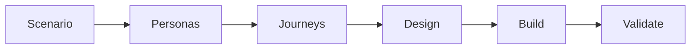

# NHS Alpha Workshop

A template for designing and building an NHS digital service with GitHub Copilot.

Start by running `/generate_scenario_and_problem_statement` in Copilot Chat. The
prompt creates the discovery scenario and replaces this file with a README for
your service.

See the [discovery guide](discovery/README.md) and
[workshop guides](docs/workshop/README.md) for the full process.

## Licence

[MIT](LICENSE)
