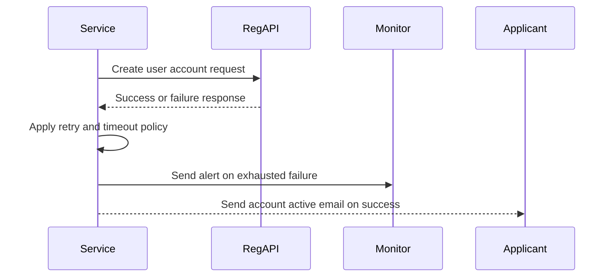
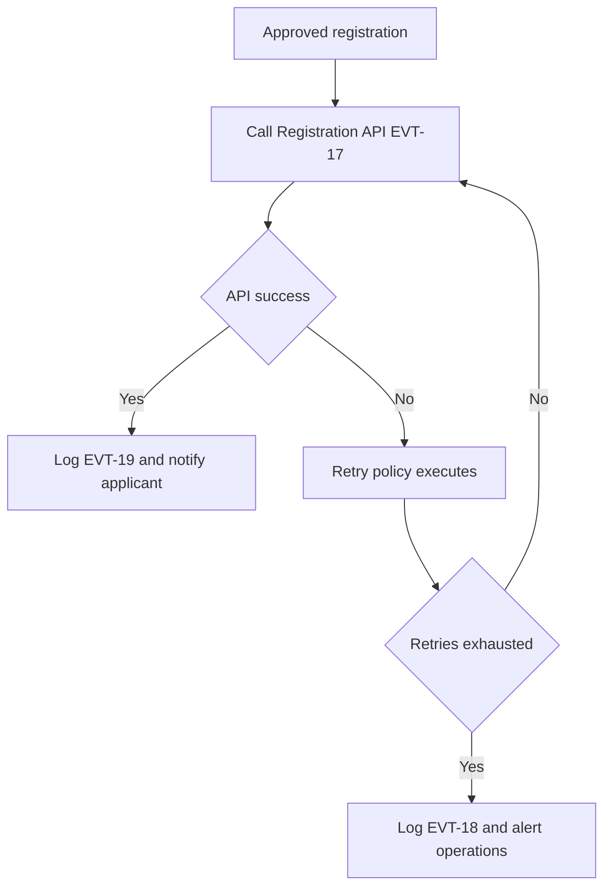

# Journey: Account Creation API Execution and Outcome

**Primary Actor:** System  
**Duration:** Seconds to minutes depending on retries  
**Preconditions:** Authorised Person approval is complete  
**Success Criteria:** Account creation API attempt and outcome are fully traceable, with failure alerts and success notification

## Overview

This journey defines the automated account creation phase after approval. It includes request attempt logging, failure handling after resilience retries, and confirmed activation.

The journey is central to removing manual helpdesk steps and proving end-to-end automation under FR-17.

## Main Flow

| Step | Actor | Action | System Response | Touchpoint | Notes |
|------|-------|--------|-----------------|-----------|-------|
| 1 | System | Receives approved registration state | Builds Registration API payload | Backend | Ready for EVT-17 |
| 2 | System | Sends account creation request | Logs API call attempt | API and Audit | EVT-17 |
| 3 | System | Handles API response | Success path or failure path chosen | Backend | Retry and timeout policy |
| 4 | System | On retry exhaustion or timeout | Logs failure and sends operational alert | Audit and Monitoring | EVT-18 |
| 5 | System | On success | Logs account created and notifies applicant | Audit and Email | EVT-19 |

## Sequence Diagram: Actor Interactions

## Decision Points & Variations

### Decision Point 1: API call outcome
**Condition:** Registration API returns success or error

**Path A: Success**
- Record account creation confirmed event
- Send activation confirmation to applicant

**Path B: Error or timeout**
- Retry using resilience policy
- Log failure if retries exhausted

### Decision Point 2: Post-failure handling
**Condition:** Failure persists after retries

**Path A: Recoverable later**
- Operational team investigates and retriggers safely
- Audit trail keeps full attempt history

**Path B: Immediate resolution not possible**
- Applicant remains pending with clear status
- Manual operational response follows alert

## Process Flow: Decision Logic

## Touchpoints

### Digital Touchpoints
- Registration API endpoint
- Resilience middleware and logs
- Monitoring alerts channel
- Applicant activation email

### Physical Touchpoints
- None

### People Involved
- System runtime: Executes API automation
- Operations team: Receives failure alerts
- Applicant: Receives activation confirmation

## Pain Points & Opportunities

### Current Pain Points
- External API instability can stall activation
- Missing attempt history complicates incident response

### Opportunities for Improvement
- Add idempotency key visibility in ops dashboard
- Add applicant pending status updates during prolonged failures

## Accessibility Considerations

- Applicant outcome notifications are clear and concise
- Status pages avoid ambiguous technical language

## Related Personas

- David Acheampong: Benefits from reduced manual creation load
- Rachel Thornton: Needs full event trace for inspection evidence

## Related Journeys

- journey-authorised-person-approval.md: Upstream approval trigger
- journey-audit-evidence-retrieval.md: Downstream evidence consumption

## Notes

Requirement mapping: FR-17, EVT-17, EVT-18, EVT-19.

## Data Elements

- API request id and correlation id
- Attempt count and failure reason
- Final outcome state and notification timestamp

## Service Level Expectations

- Every API attempt and outcome is auditable
- Failure alerts fire immediately after retry exhaustion
