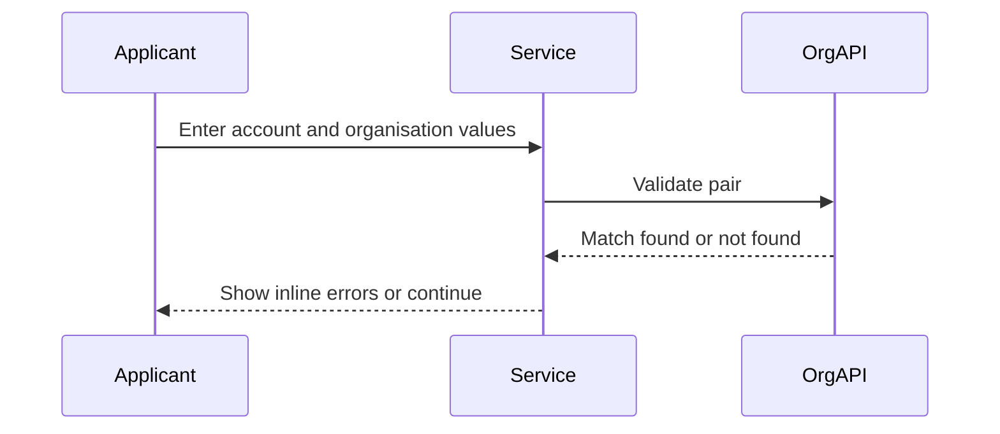
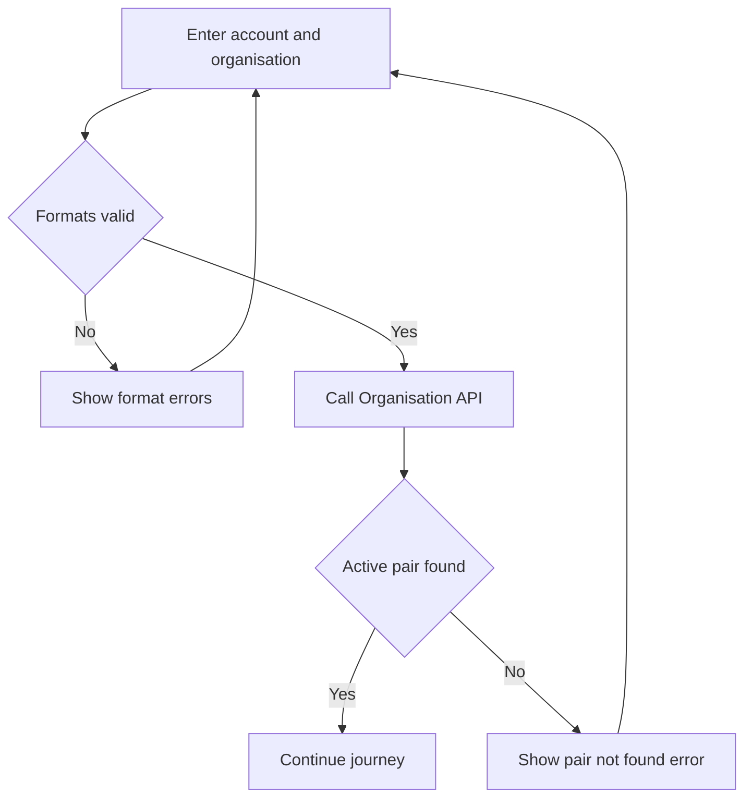

# Journey: Account and Organisation Validation Failure

**Primary Actor:** Applicant  
**Duration:** 5 to 15 minutes  
**Preconditions:** Applicant is on organisation and account step  
**Success Criteria:** Invalid account or organisation entries are corrected before progression

## Overview

This journey captures fail-fast validation when the ImmForm account number and organisation code pair is invalid or not active. It ensures error handling occurs on the organisation step, near the data entry point.

The journey supports data quality and reduces avoidable downstream failures. It also aligns with GDS error patterns for clear, actionable correction.

## Main Flow

| Step | Actor | Action | System Response | Touchpoint | Notes |
|------|-------|--------|-----------------|-----------|-------|
| 1 | Applicant | Enters account number and organisation code | Performs format checks | Web | 10-digit account rule enforced |
| 2 | System | Calls Organisation API for pair validation | Returns match or failure | API | Active pair required |
| 3 | System | Displays error summary and inline errors | Explains exact issue type | Web | Invalid format or pair not found |
| 4 | Applicant | Corrects one or both fields | Validation reruns | Web | Loop until valid |
| 5 | System | Confirms valid pair and AP presence | Allows forward progression | API and Web | Continue to check answers |

## Sequence Diagram: Actor Interactions

## Decision Points & Variations

### Decision Point 1: Format validation
**Condition:** Account number or organisation code format invalid

**Path A: Formats valid**
- Proceed to API pair validation
- Continue based on API result

**Path B: Formats invalid**
- Show field-specific errors
- Prevent API call until corrected

### Decision Point 2: Pair validation outcome
**Condition:** Organisation API cannot find active pair

**Path A: Active pair found**
- Store organisation name from API
- Continue to next step

**Path B: Pair not found**
- Show not found guidance and helpdesk route
- Keep user on organisation step

## Process Flow: Decision Logic

## Touchpoints

### Digital Touchpoints
- Organisation step form
- Organisation API validation endpoint

### Physical Touchpoints
- None

### People Involved
- Applicant: Provides and corrects identifiers
- Helpdesk: Assisted route when user cannot resolve identifiers

## Pain Points & Opportunities

### Current Pain Points
- Users often lack confidence in account identifiers
- Late validation failures increase abandonment risk

### Opportunities for Improvement
- Add inline examples for valid formats
- Include short explainers for where to find account number

## Accessibility Considerations

- Error summary with focus move and field links
- Clear language that states what to fix

## Related Personas

- Keisha Mensah: Commissioning context can cause code confusion
- Donna Eze: Limited time for repeated correction loops

## Related Journeys

- journey-nhs-new-starter-registration.md: Standard path once validation passes
- journey-duplicate-detection-error.md: Pre-submit duplicate block path

## Notes

Requirement mapping: FR-04, EVT-04.

## Data Elements

- ImmForm account number
- ImmForm organisation code
- Validation outcome code and timestamp

## Service Level Expectations

- Validation feedback shown immediately on submit of step
- No progression until active pair is confirmed
