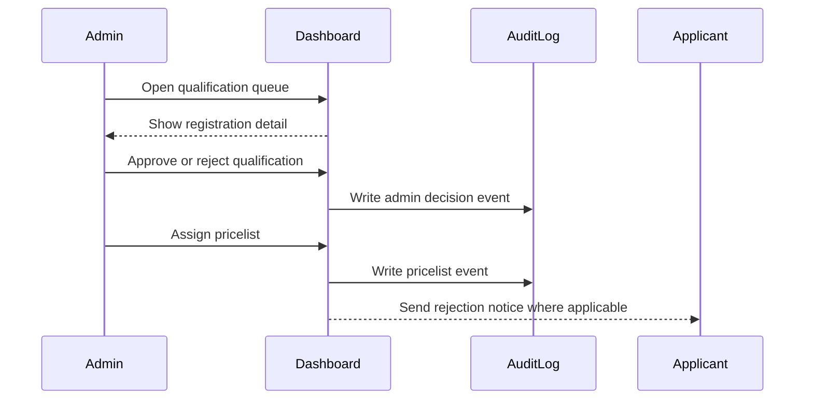
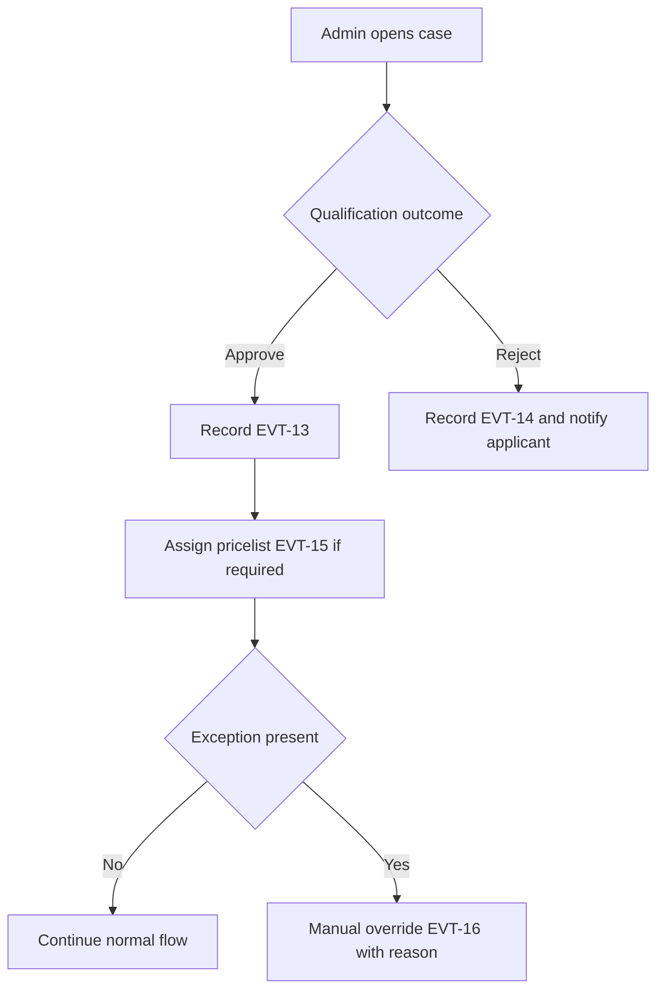

# Journey: Admin Qualification Review and Decision

**Primary Actor:** ImmForm Administrator  
**Duration:** 5 to 20 minutes per case  
**Preconditions:** Registration has reached admin qualification stage  
**Success Criteria:** Admin applies qualified decision, assigns pricelist where required, and records rationale

## Overview

This journey describes the admin dashboard workflow for qualification checks, approval or rejection decisions, and pricelist assignment actions.

It covers operational controls not handled in the applicant journey and ensures auditable admin activity for regulated review.

## Main Flow

| Step | Actor | Action | System Response | Touchpoint | Notes |
|------|-------|--------|-----------------|-----------|-------|
| 1 | Admin | Opens dashboard queue | Displays status, age, and full registration detail | Admin web | FR-19 view |
| 2 | Admin | Reviews application detail | Confirms account qualification readiness | Admin web | Includes event history |
| 3 | Admin | Approves or rejects qualification | Records decision and reason when needed | Admin web | EVT-13 or EVT-14 |
| 4 | Admin | Assigns pricelist access | Records assignment details | Admin web | EVT-15 |
| 5 | Admin | Applies manual override if exceptional | Records previous and new state with reason | Admin web | EVT-16 |

## Sequence Diagram: Actor Interactions

## Decision Points & Variations

### Decision Point 1: Qualification decision
**Condition:** Registration satisfies qualification checks

**Path A: Qualified**
- Record admin approval event
- Continue to next operational step

**Path B: Not qualified**
- Record rejection with reason
- Notify applicant with action guidance

### Decision Point 2: Exceptional handling
**Condition:** Standard path cannot proceed due to edge condition

**Path A: No override needed**
- Keep normal progression
- Maintain standard state sequence

**Path B: Manual override required**
- Record previous and new state
- Capture mandatory reason text

## Process Flow: Decision Logic

## Touchpoints

### Digital Touchpoints
- Admin dashboard list and detail views
- Audit log writer for admin events
- Notification flow for rejection communications

### Physical Touchpoints
- None

### People Involved
- ImmForm administrator: Qualification decision maker
- Applicant: Receives rejection outcome when applicable
- QA or WDA role: Reviews override evidence later

## Pain Points & Opportunities

### Current Pain Points
- High queue volume can delay qualification decisions
- Missing reason capture weakens audit evidence

### Opportunities for Improvement
- Add queue SLA indicators and filters
- Enforce structured reason templates for consistency

## Accessibility Considerations

- Dashboard tables and controls are keyboard-operable
- Decision forms include clear labels and error feedback

## Related Personas

- Fatima Osei: Related operational handling role
- Rachel Thornton: Consumes admin event records for compliance checks

## Related Journeys

- journey-fallback-case-resolution.md: Exception handling after stalls
- journey-audit-evidence-retrieval.md: Review of admin actions in audit views

## Notes

Requirement mapping: FR-19, FR-21, EVT-13, EVT-14, EVT-15, EVT-16.

## Data Elements

- Admin identity and timestamp
- Qualification decision and reason
- Pricelist assignment details
- Previous and new state for overrides

## Service Level Expectations

- Admin decisions are logged at action time
- Override actions always require explicit reason
