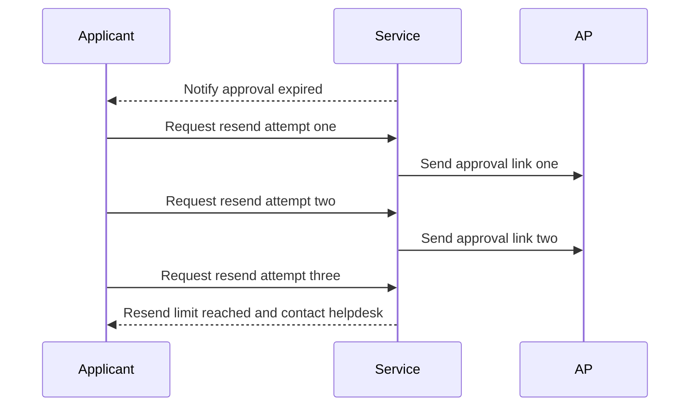
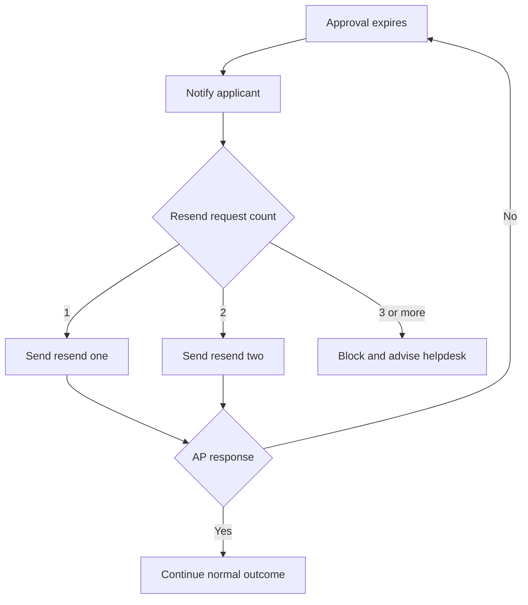

# Journey: Approval Expiry and Resend Workflow

**Primary Actor:** Applicant  
**Duration:** Up to multiple 72-hour windows  
**Preconditions:** AP approval link expired without action  
**Success Criteria:** Resend attempts are controlled, auditable, and capped with clear helpdesk fallback

## Overview

This journey defines what happens after approval expiry. It includes resend attempt one, resend attempt two, and resend-limit reached behavior.

The journey ensures consistent policy enforcement and clear applicant expectations while maintaining an audit trail for each resend action.

## Main Flow

| Step | Actor | Action | System Response | Touchpoint | Notes |
|------|-------|--------|-----------------|-----------|-------|
| 1 | System | Detects no AP action at 72 hours | Marks approval expired and notifies applicant | Workflow and Email | EVT-09 |
| 2 | Applicant | Requests resend first time | Sends new AP approval email | Web and Email | EVT-10 |
| 3 | System | Waits second 72-hour window | Tracks AP action status | Workflow | Can complete if AP responds |
| 4 | Applicant | Requests resend second time | Sends second resend to AP | Web and Email | EVT-11 |
| 5 | Applicant | Attempts third resend | Blocks resend and directs to helpdesk | Web and Email | EVT-12 |

## Sequence Diagram: Actor Interactions

## Decision Points & Variations

### Decision Point 1: AP action after resend
**Condition:** AP responds during resend window

**Path A: AP approves or rejects**
- Workflow continues to normal outcome
- No further resend required

**Path B: AP no response**
- Window expires
- Applicant can request next resend if limit not reached

### Decision Point 2: Resend attempt count
**Condition:** Applicant requests resend after second attempt already used

**Path A: Attempt count less than three**
- Resend request accepted
- New AP email sent

**Path B: Third request attempted**
- Request blocked
- Helpdesk route required

## Process Flow: Decision Logic

## Touchpoints

### Digital Touchpoints
- Applicant expiry notification email
- Resend request action in service
- AP resend emails

### Physical Touchpoints
- None

### People Involved
- Applicant: Initiates resend actions
- Authorised Person: Receives repeated approval links
- Helpdesk: Manual re-entry point after resend limit

## Pain Points & Opportunities

### Current Pain Points
- Applicants may not understand resend limits
- Multiple expiry windows can feel slow

### Opportunities for Improvement
- Show resend counter and remaining attempts clearly
- Add AP availability guidance before second resend

## Accessibility Considerations

- Resend control and state labels are screen-reader clear
- Expiry and limit messages use plain language and explicit next step

## Related Personas

- Linda Forsythe: AP workload affects response timeliness
- Fatima Osei: Handles cases that pass resend limit

## Related Journeys

- journey-authorised-person-approval.md: Primary AP decision flow
- journey-fallback-case-resolution.md: Post-limit or route-failure handling

## Notes

Requirement mapping: FR-15, EVT-10, EVT-11, EVT-12.

## Data Elements

- Expiry timestamp and resend counters
- Applicant resend actions with timestamps
- Final limit reached reason code

## Service Level Expectations

- Expiry state is communicated immediately
- Third resend attempt is blocked consistently and auditable
