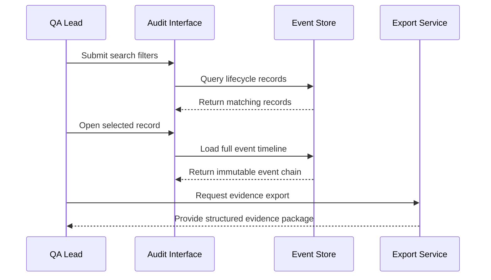
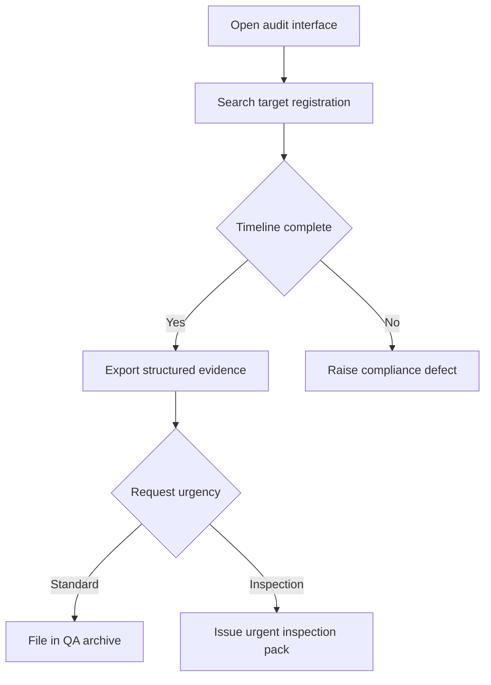

# Journey: Compliance Audit Retrieval and Evidence Export

**Primary Actor:** Rachel Thornton  
**Duration:** 10 to 30 minutes per evidence request  
**Preconditions:** Registration event records exist for target applicants and roles  
**Success Criteria:** QA lead retrieves and exports complete lifecycle evidence without helpdesk support

## Overview

This journey focuses on compliance and audit operations rather than frontline registration. It demonstrates independent retrieval and export of records needed for MHRA inspection and internal quality assurance.

The journey is essential because successful registration outcomes alone are insufficient if evidence cannot be reliably produced under audit conditions. It validates the service objective of independently retrievable lifecycle records.

## Main Flow

| Step | Actor | Action | System Response | Touchpoint | Notes |
|------|-------|--------|-----------------|-----------|-------|
| 1 | Rachel | Opens audit interface | Shows search filters and recent retrieval history | Web admin | Access controlled by role |
| 2 | Rachel | Searches by applicant or account keys | Returns matching registration lifecycle records | Audit store query | Filters include date and state |
| 3 | Rachel | Opens target record | Displays immutable timeline with actor attribution | Web admin | Includes AP and fallback actions |
| 4 | Rachel | Exports evidence package | Generates structured export with metadata | Export service | Suitable for inspection pack |
| 5 | Rachel | Files evidence for inspection | Confirms package completeness | Internal QA process | No helpdesk dependency |

## Sequence Diagram: Actor Interactions

## Decision Points & Variations

### Decision Point 1: Record completeness check
**Condition:** Timeline appears to have missing events

**Path A: Complete chain found**
- Export evidence package
- Mark request complete

**Path B: Missing event detected**
- Raise compliance issue to service owner
- Track remediation ticket before close

### Decision Point 2: Evidence request urgency
**Condition:** Request is inspection-critical

**Path A: Standard request**
- Complete within normal business day
- Attach to monthly QA review archive

**Path B: Inspection request**
- Prioritise immediate retrieval and export
- Produce pack within defined urgent SLA

## Process Flow: Decision Logic

## Touchpoints

### Digital Touchpoints
- Audit interface: Search, inspection, and export actions
- Event store: Immutable lifecycle records
- Export generator: Structured package for external review

### Physical Touchpoints
- MHRA inspection pack and internal QA evidence file sets

### People Involved
- QA lead and WDA RP: Retrieves and validates evidence
- Service owner: Receives and resolves record completeness issues

## Pain Points & Opportunities

### Current Pain Points
- Fragmented evidence retrieval creates dependence on operational teams
- Manual collation risks inconsistency during inspections

### Opportunities for Improvement
- Add one-click inspection pack profiles with pre-set filters
- Add proactive alerting for incomplete lifecycle chains

## Accessibility Considerations

- Search and filter controls operable by keyboard with clear status announcements
- Export format includes machine-readable structure and human-readable summary

## Related Personas

- Fatima Osei: Produces intervention records used in evidence chain
- Sanjay Patel: Consumer of compliance-grade evidence in regulated operations

## Related Journeys

- journey-fallback-case-resolution.md: Source of exception-handling events
- journey-holding-centre-critical-supply-registration.md: High-risk registration evidence use case

## Notes

This journey is the primary test of whether the service meets independent evidence retrieval requirements.

## Data Elements

- Search keys: Applicant name, account number, organisation code, state, date
- Event chain hash or integrity marker: Confirms immutability
- Export metadata: Generated time, requesting role, record scope
- Compliance defect reference: Tracks evidence gap remediation

## Service Level Expectations

- Standard evidence retrieval completed same working day
- Inspection-critical retrieval and export completed within two hours
