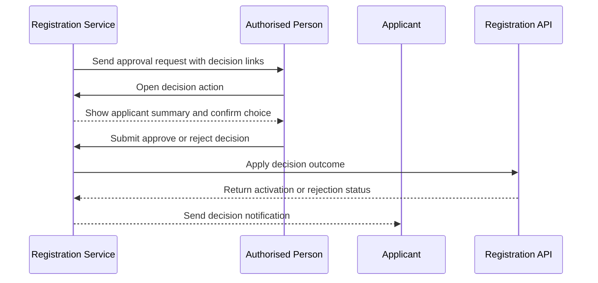
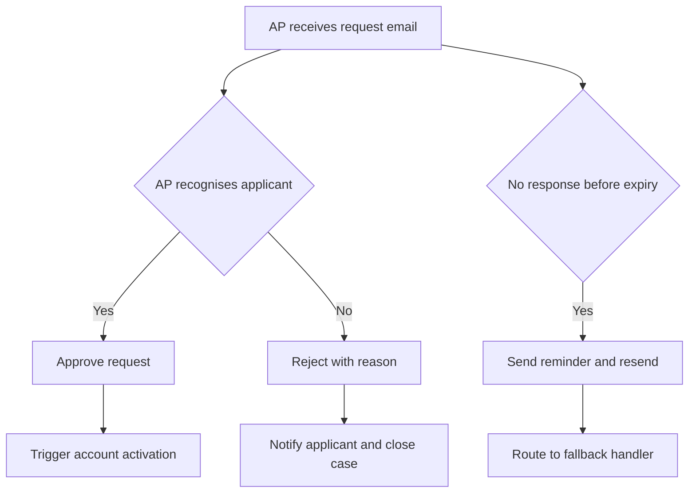

# Journey: Authorised Person Decision and Time Bound Approval

**Primary Actor:** Linda Forsythe  
**Duration:** 2 to 10 minutes for AP action  
**Preconditions:** Applicant has submitted a valid registration and AP routing has succeeded  
**Success Criteria:** AP decision is captured with timestamp and identity, then applicant is notified

## Overview

This journey isolates the AP experience, which is the most critical dependency between submission and activation. It demonstrates a low-friction email-based decision flow with explicit expiry handling.

The journey is important because AP responsiveness strongly influences activation lead time. Clear AP communications and decision capture reduce stalled requests and support compliance traceability.

## Main Flow

| Step | Actor | Action | System Response | Touchpoint | Notes |
|------|-------|--------|-----------------|-----------|-------|
| 1 | System | Sends AP request email | Includes applicant details, account details, expiry time, decision links | Email | Actionable without login |
| 2 | Linda | Reviews applicant details | Opens approve or reject link | Email and Web | Two minute target action |
| 3 | Linda | Chooses approve | Captures AP identity, timestamp, and outcome | Web | Immutable event written |
| 4 | System | Executes decision workflow | Activates account if approved or records rejection reason | API | Rejection reason persisted |
| 5 | System | Sends applicant outcome notice | Provides next steps and contact route | Email | Case closed unless fallback needed |

## Sequence Diagram: Actor Interactions

## Decision Points & Variations

### Decision Point 1: AP recognition of applicant
**Condition:** AP cannot confirm applicant identity

**Path A: Applicant is recognised**
- Approve request
- System continues to activation

**Path B: Applicant not recognised**
- Reject request with reason text
- Applicant receives actionable guidance

### Decision Point 2: AP response timing
**Condition:** AP does not respond before expiry

**Path A: AP responds before deadline**
- Decision captured and workflow ends
- Applicant notified immediately

**Path B: AP misses deadline**
- Reminder and resend schedule executes
- Case moves to fallback queue after resend limit

## Process Flow: Decision Logic

## Touchpoints

### Digital Touchpoints
- AP email template: Decision CTA and expiry context
- Decision confirmation page: Captures explicit AP action
- Applicant status email: Communicates final outcome

### Physical Touchpoints
- None in the standard path

### People Involved
- Authorised Person: Core decision maker
- Applicant: Receives outcome
- Fallback helpdesk handler: Manages expired cases

## Pain Points & Opportunities

### Current Pain Points
- AP inbox overload causes missed requests
- AP role accountability is not always clear to decision makers

### Opportunities for Improvement
- Add calendar-friendly expiry marker in email template
- Add optional delegate policy for planned AP absence

## Accessibility Considerations

- Email content readable in plain text and high zoom contexts
- Decision page supports keyboard and screen reader confirmation flows

## Related Personas

- Priya Chandrasekaran: Applicant awaiting AP decision
- Fatima Osei: Handles non-response fallback path

## Related Journeys

- journey-nhs-new-starter-registration.md: Standard applicant flow before AP action
- journey-fallback-case-resolution.md: AP non-response exception management

## Notes

AP action latency is a primary determinant of the two-day activation target.

## Data Elements

- AP identity: Decision attribution
- AP decision timestamp: SLA and compliance evidence
- Decision outcome and reason: Applicant communication and audit record
- Expiry timer events: Fallback trigger evidence

## Service Level Expectations

- AP decision action should complete in under ten minutes
- Expired requests should enter fallback handling within one hour of timeout
