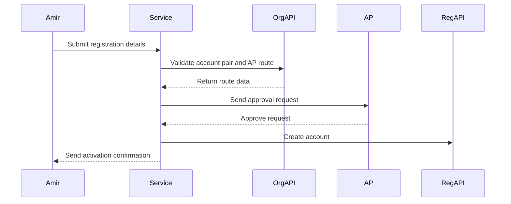
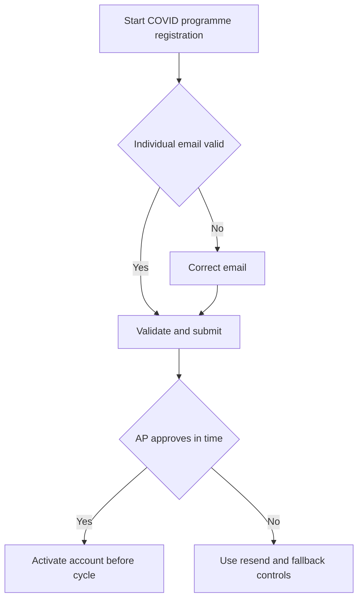

# Journey: COVID-19 Programme Registration Context

**Primary Actor:** Amir Siddiqui  
**Duration:** 1 to 2 working days  
**Preconditions:** Applicant has valid account pair for programme ordering account  
**Success Criteria:** Individual access replaces shared access without service disruption

## Overview

This journey covers COVID-19 programme orderers transitioning from shared or informal access to attributable individual access.

The registration flow is the same standard journey, but this variant focuses on continuity during programme timelines and governance transition.

## Main Flow

| Step | Actor | Action | System Response | Touchpoint | Notes |
|------|-------|--------|-----------------|-----------|-------|
| 1 | Amir | Starts registration ahead of ordering cycle | Shows standard start guidance | Web | Same FR-02 pattern |
| 2 | Amir | Enters individual details and account pair | Applies validation and shared mailbox policy | Web and API | Individual accountability enforced |
| 3 | System | Resolves AP and sends approval request | Starts time-bound approval window | API and Email | Standard FR-13 behavior |
| 4 | AP | Approves request | Triggers automated account creation | Email and API | No manual helpdesk in standard case |
| 5 | System | Sends activation message with reference | Confirms individual access active | Email | Programme continuity maintained |

## Sequence Diagram: Actor Interactions

## Decision Points & Variations

### Decision Point 1: Shared to individual transition
**Condition:** Applicant initially enters shared mailbox

**Path A: Individual email entered**
- Continue normal flow
- Preserve attributable access model

**Path B: Shared mailbox entered**
- Block and request individual email
- Continue after correction

### Decision Point 2: Programme deadline risk
**Condition:** AP decision delayed near ordering window

**Path A: Decision in time**
- Activation before critical ordering task
- No continuity gap

**Path B: Decision delayed**
- Resend and fallback mechanisms may trigger
- Operational risk increases

## Process Flow: Decision Logic

## Touchpoints

### Digital Touchpoints
- Registration web forms
- AP email decision flow
- Registration API account creation

### Physical Touchpoints
- Programme coordination planning documents

### People Involved
- Applicant coordinator
- Authorised Person
- Helpdesk for delayed exception path

## Pain Points & Opportunities

### Current Pain Points
- Legacy shared access patterns conflict with new controls
- Tight programme windows magnify approval delay impact

### Opportunities for Improvement
- Add transition guidance for shared-to-individual scenarios
- Add status transparency for pending AP decisions

## Accessibility Considerations

- Error messaging remains concise under time pressure
- Confirmation and status messages use clear headings and action text

## Related Personas

- Priya Chandrasekaran: Similar operational urgency for immunisation cycles
- Fatima Osei: Exception handling when approvals stall

## Related Journeys

- journey-nhs-new-starter-registration.md: Baseline path
- journey-approval-resend-workflow.md: Delay and resend controls

## Notes

Requirement mapping: Section 3.3 user group coverage for COVID-19 programme orderers.

## Data Elements

- Applicant identity and individual email
- Approval timing relative to ordering cycle
- Activation confirmation reference

## Service Level Expectations

- Standard target remains two working days
- Delayed approvals trigger resend policy without hidden state
