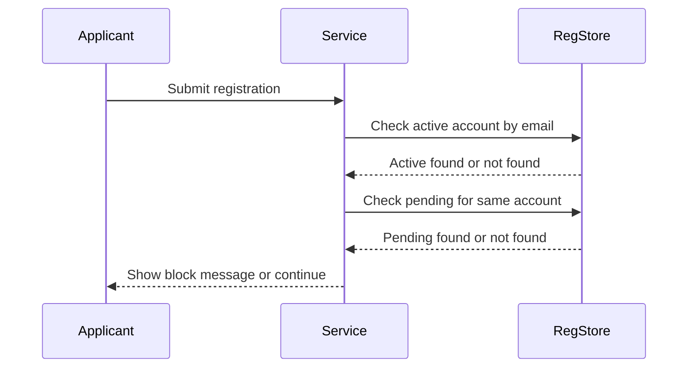
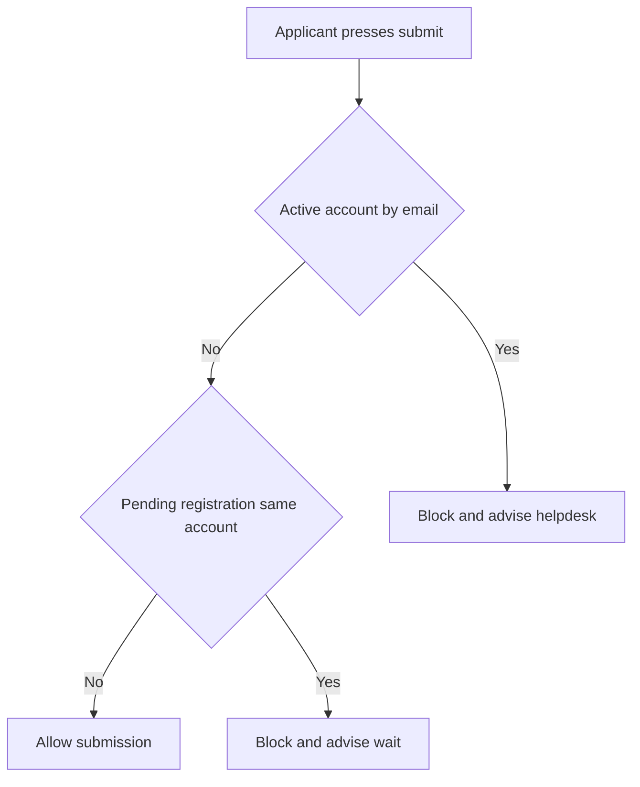

# Journey: Duplicate Detection Error Before Submission

**Primary Actor:** Applicant  
**Duration:** 5 to 10 minutes  
**Preconditions:** Applicant has entered personal and account details  
**Success Criteria:** Duplicate conditions are blocked safely and user receives clear next action

## Overview

This journey describes how the service handles duplicate registration checks before submission. It covers two requirement cases: an email already active in ImmForm and an email with a pending registration on the same account.

The journey prevents duplicate account creation and avoids wasted approval cycles. It also provides clear user guidance so applicants can resolve the issue without confusion.

## Main Flow

| Step | Actor | Action | System Response | Touchpoint | Notes |
|------|-------|--------|-----------------|-----------|-------|
| 1 | Applicant | Completes declaration and attempts submit | Starts pre-submit duplicate checks | Web | Check runs before EVT-02 commit |
| 2 | System | Checks active user account by email | If match found, blocks submission | API | Duplicate active account path |
| 3 | System | Checks pending registration for same account | If match found, blocks submission | API | Duplicate pending path |
| 4 | System | Shows error summary and inline message | Gives helpdesk route or wait guidance | Web | GDS style errors |
| 5 | Applicant | Corrects details or exits journey | Resubmits only when no duplicate exists | Web | Prevents duplicate creation |

## Sequence Diagram: Actor Interactions

## Decision Points & Variations

### Decision Point 1: Active account already exists
**Condition:** Email matches existing active ImmForm user

**Path A: No active account**
- Continue to second duplicate check
- Allow normal submission if pending check passes

**Path B: Active account found**
- Block submit
- Show contact helpdesk guidance

### Decision Point 2: Pending registration exists on same account
**Condition:** Email has pending registration for same account number

**Path A: No pending registration**
- Continue submit flow
- Create submission event

**Path B: Pending registration found**
- Block submit
- Show already in progress message

## Process Flow: Decision Logic

## Touchpoints

### Digital Touchpoints
- Registration web form: Submit and error display
- Registration data store: Active and pending checks

### Physical Touchpoints
- None

### People Involved
- Applicant: Attempts submit and receives outcome
- Helpdesk: Escalation route for active duplicate issue

## Pain Points & Opportunities

### Current Pain Points
- Users can repeatedly attempt submit without clear reason if duplicate handling is unclear
- Duplicate failures late in journey feel frustrating

### Opportunities for Improvement
- Add concise pre-submit duplicate hint text
- Include clear retry or correction guidance in error state

## Accessibility Considerations

- Error summary appears at top and links to offending fields
- Page title includes Error prefix in error state

## Related Personas

- Priya Chandrasekaran: Standard NHS applicant
- Marcus Obi: Non-NHS applicant with compliance sensitivity

## Related Journeys

- journey-nhs-new-starter-registration.md: Happy path without duplicates
- journey-field-validation-error-correction.md: Other input validation outcomes

## Notes

Requirement mapping: FR-16, EVT-03.

## Data Elements

- Applicant email: Duplicate key
- Account number: Same-account pending check scope
- Duplicate reason code: Active or pending

## Service Level Expectations

- Duplicate checks complete before final submit commit
- Block message shown immediately with clear next action
