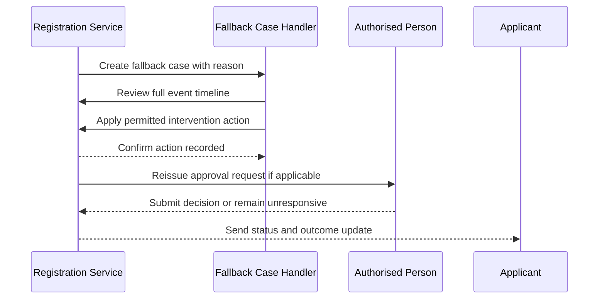
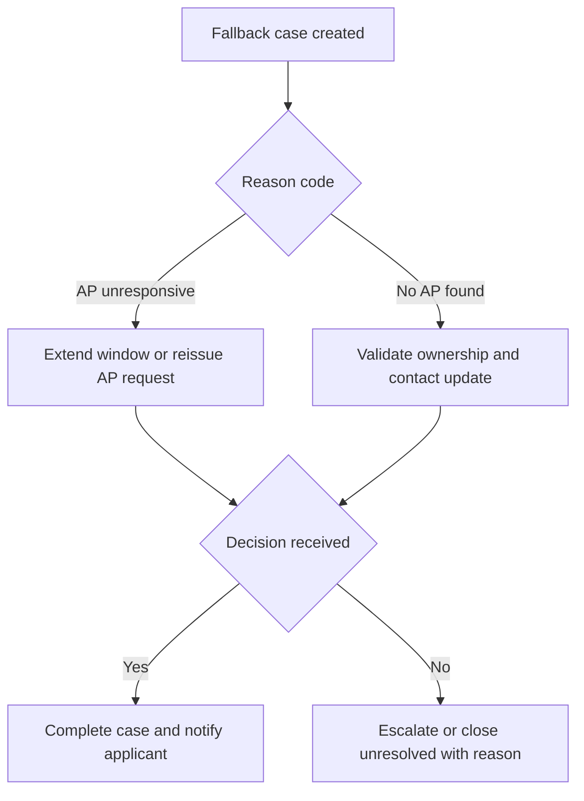

# Journey: Fallback Case Resolution for Expired or Unroutable Requests

**Primary Actor:** Fatima Osei  
**Duration:** Same day to 2 working days depending on case type  
**Preconditions:** Case has entered fallback due to AP expiry, AP lookup failure, or unresolved validation exception  
**Success Criteria:** Case reaches resolved state with documented intervention trail and applicant notified

## Overview

This journey defines how digitally-assisted helpdesk handling works after the automated path cannot complete. It demonstrates controlled human intervention without reverting to unstructured email workflows.

The journey is critical because exception handling quality determines whether automation gains are preserved. It also provides the strongest test of audit trail completeness for non-standard cases.

## Main Flow

| Step | Actor | Action | System Response | Touchpoint | Notes |
|------|-------|--------|-----------------|-----------|-------|
| 1 | System | Flags case for fallback | Creates fallback reason code and SLA timer | Admin case view | Trigger includes event history |
| 2 | Fatima | Opens assigned case | Displays chronological event log and current state | Admin case view | No email reconstruction needed |
| 3 | Fatima | Selects permitted intervention | Applies action such as extend window or update AP contact | Admin case view | Action authority enforced by role |
| 4 | System | Executes intervention | Records operator identity and intervention reason | Workflow engine | Immutable entry appended |
| 5 | Fatima | Monitors outcome | Confirms AP decision or closes unresolvable case | Admin case view | Closure reason required |
| 6 | System | Notifies applicant | Sends status update with next steps | Email | Transparent status communication |

## Sequence Diagram: Actor Interactions

## Decision Points & Variations

### Decision Point 1: Fallback reason category
**Condition:** Why case entered fallback

**Path A: AP unresponsive**
- Extend response window or reissue with updated AP contact
- Track additional expiry timeline

**Path B: No valid AP found**
- Request account owner correction path
- Close as unresolved if ownership cannot be verified

### Decision Point 2: Intervention outcome
**Condition:** Whether intervention produces valid AP decision

**Path A: Decision obtained**
- Record decision and complete activation or rejection outcome
- Notify applicant and close case

**Path B: No decision after intervention**
- Escalate to service owner under policy
- Close with documented unresolved reason

## Process Flow: Decision Logic

## Touchpoints

### Digital Touchpoints
- Admin case view: Timeline, intervention actions, SLA ageing
- Notification service: Applicant status and closure notices
- Registration event store: Immutable intervention audit entries

### Physical Touchpoints
- None required in standard fallback operation

### People Involved
- Fallback case handler: Applies controlled interventions
- Authorised Person: May receive reissued request
- Service owner: Handles escalations beyond helpdesk authority

## Pain Points & Opportunities

### Current Pain Points
- Undefined authority causes either over-escalation or risky local decisions
- Incomplete case histories force manual reconstruction and delay

### Opportunities for Improvement
- Add reason-code analytics dashboard for recurrent failure patterns
- Add guided intervention playbooks by case type

## Accessibility Considerations

- Case timeline readable with keyboard navigation and clear status semantics
- Intervention actions include explicit confirmation to prevent accidental updates

## Related Personas

- David Acheampong: Current-state helpdesk processor for manual model
- Rachel Thornton: Needs visibility of intervention records for compliance

## Related Journeys

- journey-authorised-person-approval.md: Source of many fallback triggers
- journey-audit-evidence-retrieval.md: Consumption of fallback audit data

## Notes

Fallback must remain exception-only or activation targets will regress toward current-state performance.

## Data Elements

- Fallback reason code: Classifies automation failure mode
- Handler identity: Named intervention accountability
- Intervention action and rationale: Compliance and service improvement inputs
- Case closure status: Resolved, rejected, or unresolved outcome

## Service Level Expectations

- Fallback case triage starts within four business hours
- High-risk supply cases escalated same day if unresolved after one intervention
