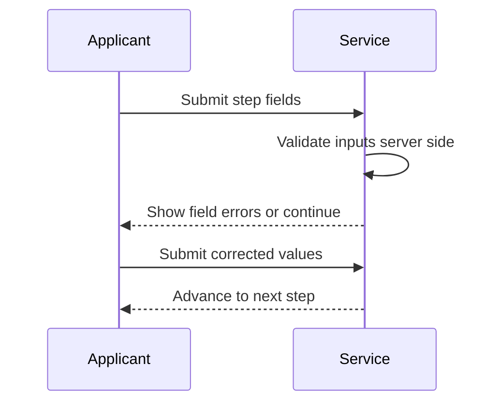
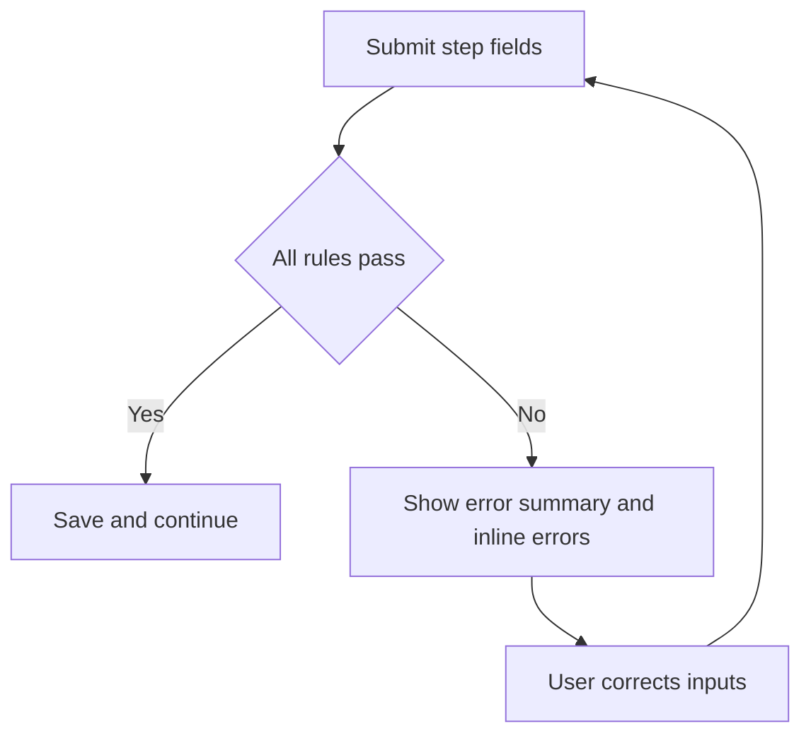

# Journey: Field Validation Error Correction

**Primary Actor:** Applicant  
**Duration:** 5 to 15 minutes  
**Preconditions:** Applicant enters one or more invalid field values  
**Success Criteria:** Validation errors are shown clearly and corrected without support dependency

## Overview

This journey covers server-side validation outcomes for common field rules such as email format, phone number format, name, and job title constraints.

It ensures users receive clear, plain-language feedback through GDS error summary and inline messages and can correct data efficiently.

## Main Flow

| Step | Actor | Action | System Response | Touchpoint | Notes |
|------|-------|--------|-----------------|-----------|-------|
| 1 | Applicant | Enters details on step page | Submits step form | Web | One thing per page pattern |
| 2 | System | Runs server-side validation | Detects rule failures by field | Backend | NFR-06 controls |
| 3 | System | Renders error summary and inline text | Focuses error summary and keeps data where safe | Web | GDS pattern |
| 4 | Applicant | Corrects invalid fields | Resubmits step | Web | Loop until valid |
| 5 | System | Accepts valid values | Progresses to next step | Web | Validation success |

## Sequence Diagram: Actor Interactions

## Decision Points & Variations

### Decision Point 1: Email validation
**Condition:** Email is invalid format or shared mailbox

**Path A: Valid individual email**
- Accept email
- Continue step progression

**Path B: Invalid email condition**
- Show targeted email error
- Require corrected individual email

### Decision Point 2: Phone and text fields
**Condition:** Phone or text length rule fails

**Path A: Values within rules**
- Save step values
- Move forward

**Path B: Rule failure**
- Show specific correction text
- Keep user on same step

## Process Flow: Decision Logic

## Touchpoints

### Digital Touchpoints
- Step form pages
- Server-side validators
- Error summary and inline components

### Physical Touchpoints
- None

### People Involved
- Applicant: Corrects invalid entries
- Helpdesk: Not needed for normal correction loop

## Pain Points & Opportunities

### Current Pain Points
- Generic error text can cause repeated failures
- Multiple field failures can overwhelm users

### Opportunities for Improvement
- Use specific examples in each error message
- Preserve non-sensitive values to reduce re-entry burden

## Accessibility Considerations

- Error summary appears at top and is announced by assistive tools
- Inline messages are tied to field labels and ids

## Related Personas

- Priya Chandrasekaran: First-time user needs plain language cues
- Colin Rafferty: Time-sensitive seasonal user needs fast correction

## Related Journeys

- journey-account-validation-failure.md: Pair-specific validation path
- journey-nhs-new-starter-registration.md: Normal path after correction

## Notes

Requirement mapping: NFR-06.

## Data Elements

- Field validation codes
- Error message ids and field mapping
- Correction submission timestamps

## Service Level Expectations

- Validation runs server-side on every step submit
- Error feedback is immediate and actionable
