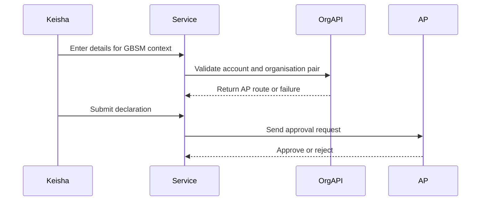
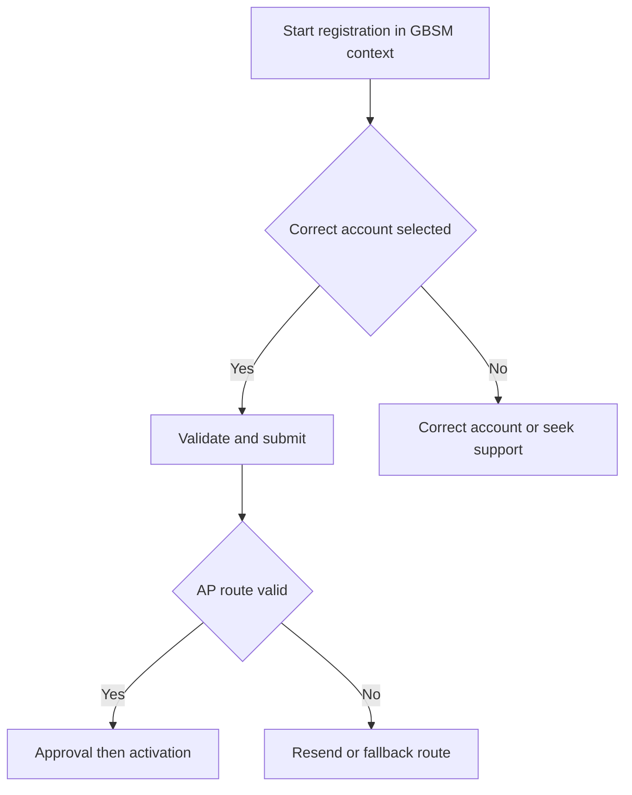

# Journey: GBSM Sexual Health Registration Context

**Primary Actor:** Keisha Mensah  
**Duration:** 1 to 2 working days  
**Preconditions:** Applicant has access to sexual health service account identifiers  
**Success Criteria:** Registration completes with correct account ownership and AP routing in a commissioned service context

## Overview

This journey provides programme-context coverage for GBSM sexual health orderers operating in dual organisational settings such as local authority commissioning and NHS trust delivery.

The underlying registration flow remains the same as standard track, but this variant stresses account ownership clarity and AP route confidence.

## Main Flow

| Step | Actor | Action | System Response | Touchpoint | Notes |
|------|-------|--------|-----------------|-----------|-------|
| 1 | Keisha | Starts registration with service context in mind | Shows standard checklist and account requirements | Web | Shared flow baseline |
| 2 | Keisha | Enters applicant and account details | Validates formats and account pair | Web and API | Ownership ambiguity risk |
| 3 | System | Resolves AP from account pair | Returns AP route or error | API | Fail-fast if no AP |
| 4 | Keisha | Submits declaration | Creates auditable submission event | Web | Same standard declarations |
| 5 | AP | Approves request | Triggers account creation flow | Email | Standard AP process |

## Sequence Diagram: Actor Interactions

## Decision Points & Variations

### Decision Point 1: Account ownership clarity
**Condition:** Applicant is unsure whether trust or commissioner account applies

**Path A: Correct account used**
- Validation succeeds
- Continue normal workflow

**Path B: Wrong account used**
- Validation fails or AP mismatch occurs
- Applicant corrects details or seeks helpdesk support

### Decision Point 2: AP route validity
**Condition:** AP on record is outdated

**Path A: AP valid**
- Approval completes
- Account activation proceeds

**Path B: AP outdated**
- Expiry and resend path may trigger
- Fallback handling required

## Process Flow: Decision Logic

## Touchpoints

### Digital Touchpoints
- Registration web journey
- Organisation API validation
- AP email approval flow

### Physical Touchpoints
- Internal service handover notes for account ownership

### People Involved
- Applicant in sexual health service role
- Authorised Person for account
- Helpdesk for ownership ambiguity resolution

## Pain Points & Opportunities

### Current Pain Points
- Commissioning versus provider boundaries create account uncertainty
- AP records can lag organisational change

### Opportunities for Improvement
- Add guidance examples for commissioned services
- Add account ownership hint before organisation step

## Accessibility Considerations

- Guidance content uses plain language and short sentences
- Validation errors remain field-linked and screen-reader clear

## Related Personas

- Donna Eze: Similar sexual health programme pressure
- Linda Forsythe: AP decision role

## Related Journeys

- journey-nhs-new-starter-registration.md: Shared baseline registration flow
- journey-account-validation-failure.md: Correction path for account mismatch

## Notes

Requirement mapping: Section 3.3 user group coverage for GBSM programme orderers.

## Data Elements

- Account type and organisation identifiers
- AP route result
- Submission and approval timestamps

## Service Level Expectations

- Context complexity should not increase baseline activation target
- Ownership ambiguity should be resolved early in journey
