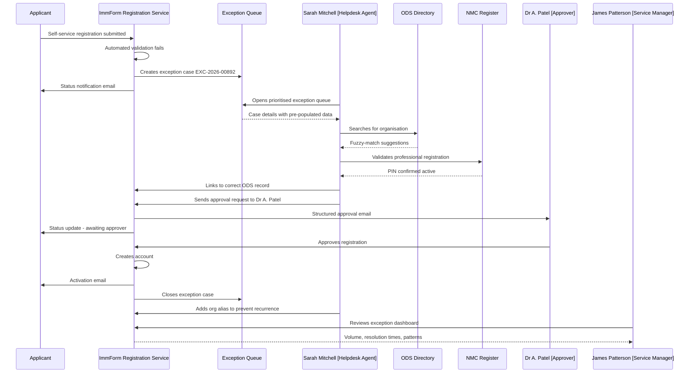
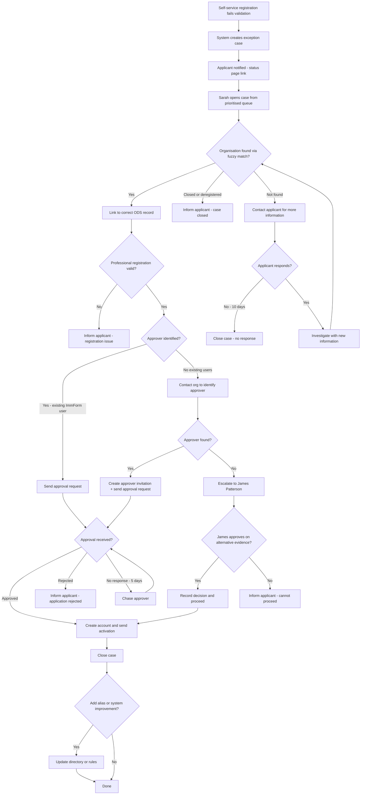
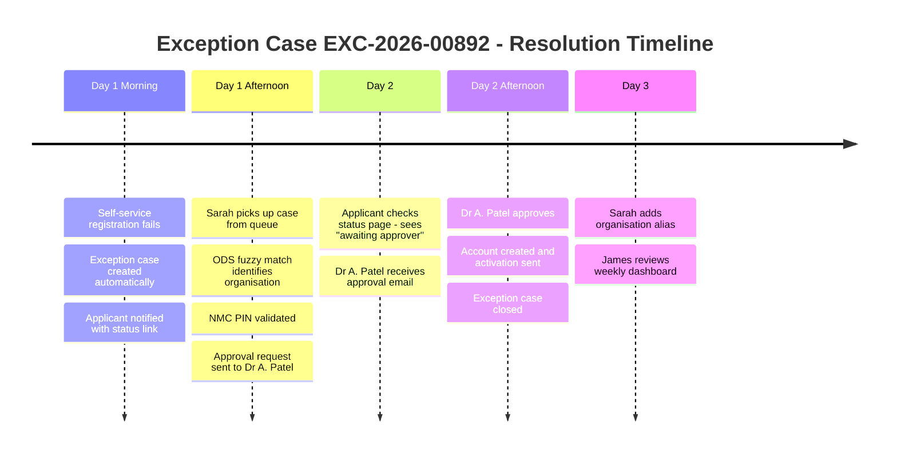

# Journey: Helpdesk Exception Handling

**Primary Actor:** Sarah Mitchell — ImmForm Helpdesk Agent  
**Duration:** 1–3 working days (from escalation to resolution)  
**Preconditions:**
- A self-service registration has been submitted but has failed automated validation or approval
- The applicant's organisation is unrecognised in the ODS/ImmForm directory, or no valid approver can be identified
- The case has been automatically escalated to the helpdesk exception queue
- Sarah has an active ImmForm helpdesk account with case-management permissions
- James Patterson (Service Delivery Manager) is available for second-tier escalation if needed

**Success Criteria:**
- The exception is resolved: the applicant either receives an account or is informed why registration cannot proceed
- All investigation steps are recorded in a structured audit trail — no email-thread evidence
- The applicant receives proactive status updates at each stage (no "chasing" required)
- Resolution data feeds back into the system to prevent the same exception recurring (e.g. adding a newly verified organisation)
- Sarah's time is spent on investigation, not data re-entry from PDFs
- James Patterson can see exception volumes, resolution times, and recurring patterns in his dashboard

## Overview

This journey covers the exception path — what happens when self-service registration cannot complete because the system cannot automatically verify the applicant's organisation or identify a valid approver. In the current process, these cases arrive as unstructured emails or phone calls, are tracked in spreadsheets, and resolved through long email chains. Sarah Mitchell re-keys data from PDFs, chases approvers manually, and has no structured way to communicate progress to the applicant.

The redesigned journey replaces this with a structured exception-management workflow. Cases arrive in a prioritised queue with all submitted data pre-populated. Sarah investigates using integrated lookup tools (ODS, NMC, GPhC registers). The applicant can see their case status in real time. Every action Sarah takes is logged automatically. James Patterson gets a dashboard view of exception volumes, resolution times, and recurring patterns — enabling him to spot systemic issues and request system changes (e.g. adding missing organisations to the directory).

This journey demonstrates how the system handles the 20% of cases that cannot be self-service — ensuring they are resolved efficiently without undermining the audit trail or the applicant's experience.

## Main Flow

| Step | Actor | Action | System Response | Touchpoint | Notes |
|------|-------|--------|-----------------|------------|-------|
| 1 | System | A self-service registration fails automated validation: "Organisation not found in ODS directory" | Creates an exception case (e.g. EXC-2026-00892), assigns priority based on rules (vaccine-handling org = high), adds to Sarah's queue | System | Automated escalation — no manual triage needed |
| 2 | System | Sends a status notification to the applicant | Email: "Your ImmForm registration (ref IMM-REG-2026-01234) needs additional verification. Our team is reviewing your application. You can check your status at [link]. No action is needed from you at this time." | Email | Proactive communication — applicant is not left waiting with no information |
| 3 | Sarah | Opens the exception queue in her dashboard, reviews prioritised cases | Dashboard shows: case ref, applicant name, organisation entered, reason for escalation, priority, time in queue, SLA countdown | Web | Cases sorted by priority then age — high-priority vaccine-handling orgs surface first |
| 4 | Sarah | Opens case EXC-2026-00892 | System displays all submitted data (pre-populated from self-service form), the specific validation failure reason, and suggested investigation steps | Web | No PDF re-keying — all data is already structured in the case |
| 5 | Sarah | Uses the integrated ODS lookup to search for the organisation by name, postcode, and type | System queries ODS API and displays potential matches: "Did you mean: Riverside Medical Centre (ODS: Y12345) — GP Practice, Riverside Health, BS1 4QT?" | Web | Integrated lookup eliminates alt-tabbing to separate systems |
| 6 | Sarah | Identifies the correct match: the applicant entered "Riverside Medical" but the ODS record is "Riverside Medical Centre" | Sarah selects the match, system links the registration to the correct ODS record | Web | Fuzzy-match suggestion saves investigation time |
| 7 | Sarah | Verifies the applicant's professional registration (NMC PIN check) | System validates the NMC PIN against the register and confirms: "NMC PIN 12A3456B — Active, Registered Nurse" | Web | Integrated validation — no manual register lookup needed |
| 8 | Sarah | Identifies the approver for Riverside Medical Centre from the ODS record | System suggests: "Practice Manager: Dr A. Patel (existing ImmForm user). Send approval request?" | Web | System identifies potential approvers from existing ImmForm accounts linked to the ODS code |
| 9 | Sarah | Sends the approval request to Dr A. Patel | System sends a structured approval request via email with applicant details and a one-click approve/reject link | Web + Email | Approval request includes all information the approver needs — no back-and-forth |
| 10 | Sarah | Adds a case note: "Organisation matched to ODS Y12345. Approval request sent to Dr A. Patel. Awaiting response." | System timestamps the note, links it to the case, and updates the case status to "Awaiting Approver Response" | Web | Every action logged — no email-thread evidence |
| 11 | System | Updates the applicant's status page | Status page shows: "Your application is being processed. We have contacted your organisation's approver. Expected response within 2 working days." | Web | Applicant can self-serve status checks instead of calling the helpdesk |
| 12 | Dr A. Patel | Receives the approval email, clicks "Approve" | System records the approval with timestamp and approver identity | Email + Web | Same approval flow as Journey 1 — consistent experience |
| 13 | System | Approval received — completes the registration | Creates the applicant's account, sends activation email, closes the exception case | System + Email | Exception resolved — case auto-closes |
| 14 | Sarah | Reviews the closed case, adds resolution data | System prompts: "Would you like to add 'Riverside Medical' as an alias for 'Riverside Medical Centre' to prevent future escalations?" Sarah confirms | Web | Feedback loop — exception data improves the system |
| 15 | James | Reviews exception dashboard at end of week | Dashboard shows: 23 exceptions this week, avg resolution 1.2 days, top reason "Organisation name mismatch" at 47%, trend down 12% from last week | Web | Operational insight for service improvement |

## Sequence Diagram: Exception Handling Flow

## Decision Points & Variations

### Decision Point 1: Organisation Lookup
**Condition:** When Sarah searches for the applicant's organisation

**Path A: Fuzzy match found in ODS directory**
- Sarah selects the correct match
- Registration proceeds with the matched ODS code
- System prompts to add the original input as an alias

**Path B: No match found in ODS directory**
- Sarah escalates: adds a case note, contacts the applicant for additional information (phone or structured message)
- If the organisation is genuine but not in ODS (e.g. a new practice), Sarah creates a manual organisation record pending ODS update
- Case priority may increase if the organisation handles vaccines

**Path C: Organisation exists but is closed or deregistered**
- Sarah informs the applicant: "This organisation is no longer registered. If you believe this is an error, please contact [ODS team]"
- Case closed with resolution "Organisation deregistered"

### Decision Point 2: Approver Identification
**Condition:** When Sarah attempts to find an approver for the organisation

**Path A: Existing ImmForm user identified as approver**
- System suggests the approver
- Sarah sends a structured approval request

**Path B: No existing ImmForm users at the organisation**
- Sarah contacts the organisation directly (phone) to identify a senior staff member who can approve
- If an approver is identified, Sarah creates an approver invitation
- Two registrations now proceed in parallel: the approver and the original applicant

**Path C: Organisation has no clear governance structure for approval**
- Sarah escalates to James Patterson (Service Delivery Manager) for a decision
- James may approve based on alternative evidence (e.g. NHS Employment Check, professional registration confirmation)
- Escalation and decision are recorded in the audit trail

### Decision Point 3: Applicant Responsiveness
**Condition:** When Sarah contacts the applicant for additional information

**Path A: Applicant responds within 2 working days**
- Investigation continues with the new information

**Path B: Applicant does not respond within 5 working days**
- System sends a reminder: "We need additional information to process your registration. Please respond by [date] or your application will be closed"
- If no response within 10 working days, case is closed with resolution "No applicant response"
- Applicant can re-apply at any time

### Decision Point 4: SLA Breach
**Condition:** When a case approaches or exceeds the 3-working-day SLA

**Path A: Case resolved within SLA**
- Normal closure

**Path B: Case approaching SLA (2 working days elapsed)**
- System highlights the case in amber on Sarah's dashboard
- Sarah receives a notification: "Case EXC-2026-00892 is approaching SLA. Current status: Awaiting Approver Response"

**Path C: Case breaches SLA**
- System highlights the case in red, auto-escalates to James Patterson
- James reviews and decides: extend SLA with justification, or intervene directly

## Process Flow: Exception Handling Logic

## Timeline: Typical Exception Resolution

## Touchpoints

### Digital Touchpoints
- **Exception queue dashboard (web):** Sarah's primary workspace — prioritised list with SLA indicators, pre-populated case data, integrated lookup tools
- **Applicant status page (web):** Real-time status visible to the applicant — replaces phone calls and email chasers
- **Integrated ODS lookup (web):** Organisation search with fuzzy matching, embedded in the case view
- **Integrated NMC/GPhC lookup (web):** Professional register validation, embedded in the case view
- **Email notifications:** Applicant status updates, approver requests, SLA warnings
- **Service manager dashboard (web):** James Patterson's view — exception volumes, resolution times, recurring patterns, SLA compliance

### Physical Touchpoints
- **Phone (outbound):** Sarah may call the applicant or organisation if digital communication is insufficient — the call is logged as a case note
- **No paper:** No PDFs, no printed forms, no physical signatures in the redesigned journey

### People Involved
- **Sarah Mitchell (Helpdesk Agent):** Primary investigator and case owner
- **The Applicant:** The person whose registration failed automated validation — receives status updates, may need to provide additional information
- **The Approver (identified during investigation):** Approves the registration once the organisation is verified
- **James Patterson (Service Delivery Manager):** Second-tier escalation for complex cases, reviews operational dashboards
- **Amrita Chopra (Product Manager):** Uses exception pattern data to prioritise system improvements (not directly involved in individual cases)

## Pain Points & Opportunities

### Current Pain Points (As-Is)
- **PDF re-keying:** Sarah manually re-types data from PDF forms into the back-office system — introduces typos and takes significant time. Sarah says: "Anything that stops me from re-keying twenty fields from a PDF into a back-office screen is the win"
- **Email-chain investigation:** Investigation happens via email threads — no structured audit trail, no SLA tracking, no visibility for the applicant
- **No applicant visibility:** Applicants have no way to check their status — they call or email the helpdesk, adding to Sarah's workload
- **Spreadsheet tracking:** Exception cases tracked in spreadsheets — no priority logic, no SLA enforcement, no pattern analysis
- **Volume spikes overwhelm the team:** During seasonal vaccine campaigns, exception volumes spike and there is no way to triage or prioritise
- **Repetitive exceptions:** The same organisation-name mismatches cause repeated escalations because there is no feedback loop to update the directory
- **RSI risk:** Sarah has mild RSI and uses a vertical mouse — the current process requires extensive mouse-based navigation between systems

### Opportunities for Improvement (To-Be)
- **Pre-populated case data:** All submitted data flows directly into the case — no PDF re-keying
- **Structured investigation workflow:** Integrated ODS, NMC, and GPhC lookups within the case view — no alt-tabbing between systems
- **Real-time applicant status:** Applicants self-serve status checks instead of calling the helpdesk
- **SLA-driven prioritisation:** Cases automatically prioritised by type, age, and SLA proximity
- **Feedback loop:** Exception resolutions (e.g. organisation aliases) feed back into the system to prevent recurrence
- **Operational dashboard:** James Patterson sees patterns, volumes, and resolution times — enabling data-driven service improvement
- **Keyboard-navigable interface:** All helpdesk screens navigable by keyboard for Sarah's accessibility needs

## Accessibility Considerations

- Exception queue dashboard is fully keyboard-navigable — Sarah can review, open, and action cases without a mouse (WCAG 2.1.1)
- SLA indicators use colour AND icons/text: amber triangle for approaching SLA, red circle for breached — not colour alone (WCAG 1.4.1)
- Case notes support voice dictation input as an alternative to typing — reduces RSI strain (WCAG 2.5.4)
- Status page for applicants meets WCAG 2.2 AA: clear headings, logical reading order, no auto-refresh that loses focus (WCAG 2.2.2)
- All interactive elements have visible focus indicators with a minimum 3:1 contrast ratio (WCAG 2.4.7)
- Error messages in the investigation workflow are descriptive and linked to the relevant field (WCAG 3.3.1)

## Related Personas

- **Sarah Mitchell (Persona 10):** Primary actor — helpdesk agent investigating and resolving the exception
- **James Patterson (Persona 11):** Service Delivery Manager — second-tier escalation, operational dashboards. "I want my helpdesk fighting exceptions, not data-entry. Self-service for the routine 80%."
- **Amrita Chopra (Persona 12):** Product Manager — uses exception pattern data to prioritise system improvements
- **The Applicant (various personas):** Could be any registrant whose self-service application triggered an exception
- **Dr Olu Babatunde (Persona 14):** GDP Compliance Lead — may be consulted if the exception involves a wholesaler registration
- **Rachel Goldstein (Persona 15):** DPO — ensures exception-handling process does not create new data-protection risks (e.g. personal data in case notes)

## Related Journeys

- **Journey 1: Standard Self-Service Registration** — the happy path that this journey handles exceptions for
- **Journey 6: Wholesaler Registration with GDP Compliance** — wholesaler exceptions may require GDP-specific investigation steps
- **Journey 3: Approver Notification and Response** — the approval sub-flow used once an approver is identified during investigation
- **Journey 12: Service Manager Operational Review** — how James Patterson uses the exception dashboard for service improvement

## Notes

- The integrated ODS, NMC, and GPhC lookups shown in this journey assume API access to these registers. In Alpha, these may be lookup-by-reference (entering a known code) rather than full fuzzy-search. The key design principle is that the lookup is embedded in the case view — not a separate system.
- The "add alias" feedback loop (step 14) is a powerful feature but needs governance: who can add aliases, how are they reviewed, and how do we prevent incorrect aliases? This should be a separate user story with its own acceptance criteria.
- Sarah's RSI and accessibility needs (vertical mouse, keyboard navigation preference) are design constraints for the entire helpdesk interface, not just this journey. The helpdesk UI should be tested with keyboard-only navigation as a core requirement.
- James Patterson's dashboard needs are partly addressed here but deserve a separate journey (Journey 12: Service Manager Operational Review) to cover API integration with his ITSM tool — he says: "I want the new service to emit APIs my ITSM tool can ingest."
- The SLA of 3 working days is a suggested target based on the scenario document's goal of "<1 day for straightforward cases." Exception cases are by definition not straightforward, so a longer SLA is appropriate. The exact SLA should be agreed with James Patterson and validated against current exception-resolution times.
- The applicant status page raises a question about authentication: does the applicant (who does not yet have an ImmForm account) access the status page via the reference number and email combination, or via a magic link? This needs a design decision.
