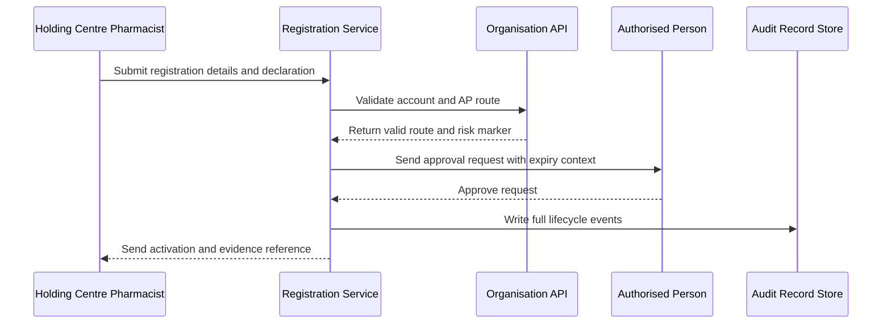
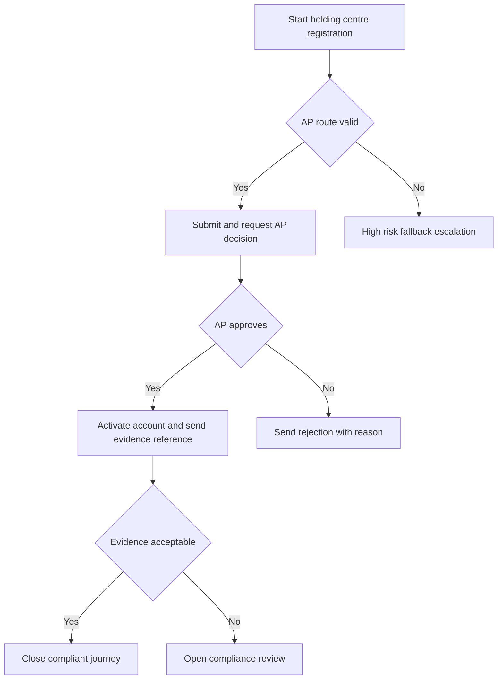

# Journey: Immunoglobulin Holding Centre Registration with No Supply Gap

**Primary Actor:** Sanjay Patel  
**Duration:** 1 to 2 working days with priority handling for continuity risk  
**Preconditions:** Applicant has holding centre account details and compliant individual identity information  
**Success Criteria:** Registration activates without ordering gap and produces inspection-ready lifecycle evidence

## Overview

This journey represents a high-consequence non-NHS context where ordering continuity has direct patient safety implications. It demonstrates stricter expectations for audit quality while still using the same digital registration architecture.

The journey validates that the service can support designated holding centre accounts with robust AP routing, traceability, and rapid exception escalation where supply continuity is at risk.

## Main Flow

| Step | Actor | Action | System Response | Touchpoint | Notes |
|------|-------|--------|-----------------|-----------|-------|
| 1 | Sanjay | Starts registration and reviews compliance statement | Shows record retention and audit scope summary | Web | Compliance context visible before data entry |
| 2 | Sanjay | Enters identity and account details | Performs strict field validation and policy checks | Web | Individual accountability enforced |
| 3 | System | Validates account pair and AP route | Returns AP data and continuity risk marker | API | High-risk profile flagged |
| 4 | Sanjay | Submits declaration | Stores immutable submission event | Web | Includes context of holding centre role |
| 5 | System | Sends AP request and priority tracking | Applies standard expiry with high-risk monitoring | Email and Workflow | Priority queue for fallback |
| 6 | AP | Approves request | Decision metadata persisted | Email | Approval identity retained |
| 7 | System | Activates account and issues evidence reference | Sends activation and record reference to applicant | API and Email | Reference supports audit retrieval |

## Sequence Diagram: Actor Interactions

## Decision Points & Variations

### Decision Point 1: AP route confidence
**Condition:** AP appears outdated or unreachable

**Path A: AP responds normally**
- Activation completes in standard time
- No supply continuity risk event triggered

**Path B: AP route failure**
- Fallback raised with high-risk marker
- Same-day escalation policy applied

### Decision Point 2: Audit adequacy check
**Condition:** Applicant reviews completion evidence quality

**Path A: Evidence is complete**
- Applicant files record in GDP dossier
- Journey closes as compliant

**Path B: Evidence appears incomplete**
- Applicant raises compliance query
- Service owner review is triggered

## Process Flow: Decision Logic

## Touchpoints

### Digital Touchpoints
- Registration service: Data entry, declarations, status
- AP email flow: Decision action and expiry
- Audit record store: Lifecycle evidence capture and retrieval references

### Physical Touchpoints
- Internal GDP compliance dossier where evidence is filed

### People Involved
- Applicant pharmacist: Requires continuity and compliance confidence
- Authorised Person: Approves account access
- Fallback case handler and service owner: Handle high-risk exceptions

## Pain Points & Opportunities

### Current Pain Points
- Any access gap creates patient safety and compliance risk
- Confidence in AP data quality is variable for specialised accounts

### Opportunities for Improvement
- Add proactive AP data quality checks for designated high-risk accounts
- Add explicit priority banner and fast-track fallback trigger for continuity risk

## Accessibility Considerations

- Complex compliance guidance written in plain language with expandable detail
- Status indicators and timelines readable with assistive technology

## Related Personas

- Marcus Obi: Similar non-NHS compliance needs in wholesaler context
- Rachel Thornton: Consumes records for MHRA evidence

## Related Journeys

- journey-non-nhs-wholesaler-registration.md: Standard non-NHS pathway
- journey-fallback-case-resolution.md: High-risk fallback intervention route

## Notes

This journey should be used to test policy for high-risk escalation and evidence completeness thresholds.

## Data Elements

- Continuity risk marker: Determines escalation speed
- Evidence reference id: Retrieval handle for compliance review
- AP route status: Route confidence and fallback trigger
- Lifecycle event chain: End-to-end traceability record

## Service Level Expectations

- High-risk fallback triaged same business day
- No unresolved high-risk case should exceed two working days without service owner action
