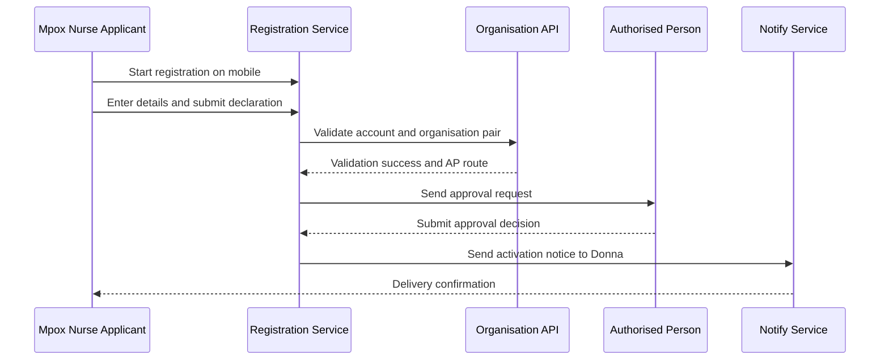
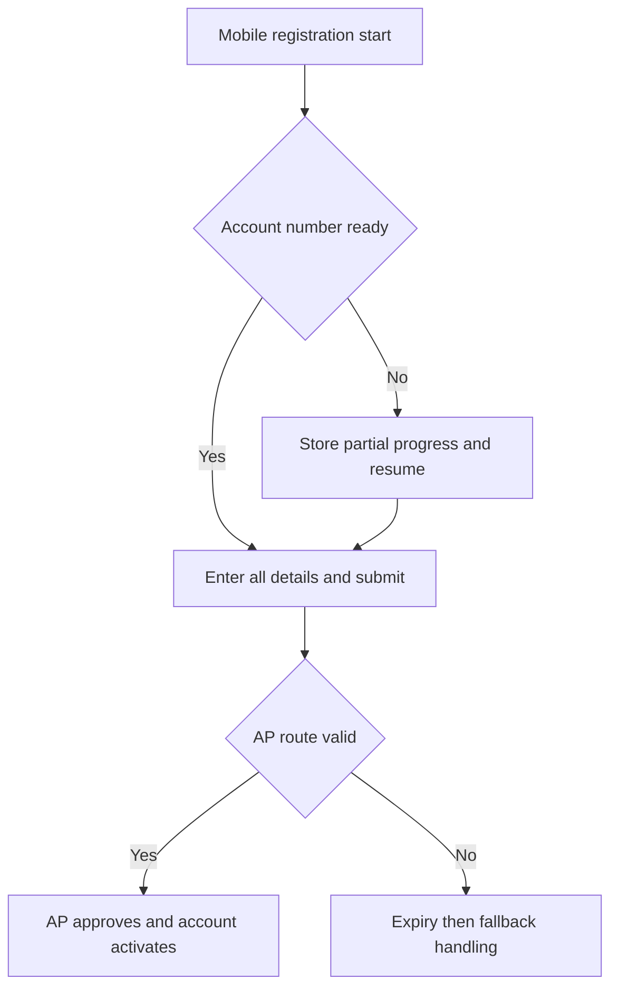

# Journey: Mobile First Registration for Mpox Programme Continuity

**Primary Actor:** Donna Eze  
**Duration:** 20 to 40 minutes plus AP response time  
**Preconditions:** Applicant has mobile access, account identifiers, and individual NHS email  
**Success Criteria:** Applicant completes registration in one mobile session and receives activation before next ordering window

## Overview

This journey captures a clinically busy programme user completing registration from a mobile device. It tests whether the service supports constrained time windows and high-urgency programme continuity.

The journey is important because Mpox delivery teams cannot tolerate avoidable ordering disruption. Mobile-ready completion and clear fallback guidance are key to preventing stock cycle delays.

## Main Flow

| Step | Actor | Action | System Response | Touchpoint | Notes |
|------|-------|--------|-----------------|-----------|-------|
| 1 | Donna | Opens service on mobile | Presents concise mobile checklist and progress indicator | Mobile web | One-screen checklist |
| 2 | Donna | Enters applicant details and account pair | Applies mobile-friendly validation and correction prompts | Mobile web | Inline errors avoid page jumps |
| 3 | System | Validates account pair and AP route | Confirms AP found and submission ready | API | Supports programme account type |
| 4 | Donna | Accepts declaration and submits | Creates registration event and sends AP request | Mobile web and Email | Submission complete in one session |
| 5 | System | Sends status updates to Donna | Sends submit confirmation and decision outcome | Email | No repeated login needed |
| 6 | Linda or AP | Approves request | Decision triggers account activation | Email | AP journey unchanged |

## Sequence Diagram: Actor Interactions

## Decision Points & Variations

### Decision Point 1: Missing account number at point of entry
**Condition:** Applicant does not have account number ready

**Path A: Account number available**
- Continue in same mobile session
- Submit normally

**Path B: Account number unavailable**
- Save partial progress token
- Resume later without re-entering all fields

### Decision Point 2: AP route appears outdated
**Condition:** Applicant suspects AP no longer in post

**Path A: AP is current**
- Approval completes within standard window
- Account activated

**Path B: AP outdated**
- Request expires after resend policy
- Case moves to fallback and applicant is informed

## Process Flow: Decision Logic

## Touchpoints

### Digital Touchpoints
- Mobile registration web pages: Form completion and validation
- Email notifications: Submission and outcome updates
- Organisation API validation: Account pair and AP route checks

### Physical Touchpoints
- Handover conversation with departing colleague for account identifiers

### People Involved
- Applicant: Completes mobile submission
- Authorised Person: Provides decision
- Fallback case handler: Resolves AP route failures

## Pain Points & Opportunities

### Current Pain Points
- Clinical workload competes with admin tasks
- Account identifier retrieval depends on informal handover

### Opportunities for Improvement
- Add optional quick capture mode with deferred non-critical fields
- Add explicit programme context badges for Mpox users

## Accessibility Considerations

- Responsive layout at mobile zoom with no horizontal scroll
- Touch target size and error messaging optimised for handheld use

## Related Personas

- Keisha Mensah: Similar commissioned service ambiguity in account ownership
- Fatima Osei: Handles stalled cases caused by AP data issues

## Related Journeys

- journey-nhs-new-starter-registration.md: Baseline registration behaviour
- journey-fallback-case-resolution.md: Stalled request intervention flow

## Notes

This journey pressure-tests one-session completion and continuity risk before colleague handover closes.

## Data Elements

- Device context: Mobile experience quality signal
- Partial save token: Resume capability state
- AP route confidence flag: Signals likely fallback risk
- Outcome notification timestamp: Programme planning evidence

## Service Level Expectations

- Mobile form completion in under forty minutes for prepared users
- Stalled AP routes surfaced to fallback team within one expiry cycle
