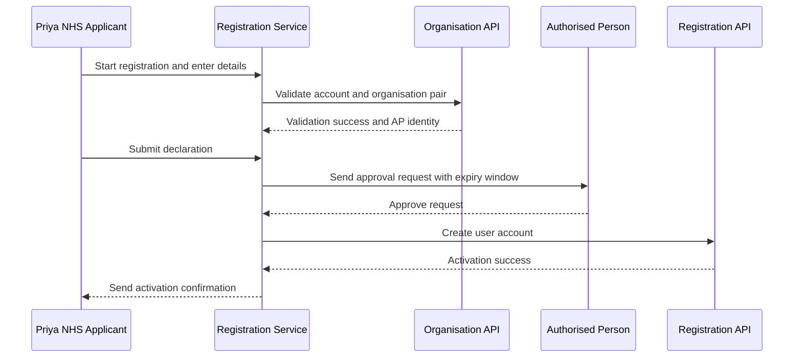
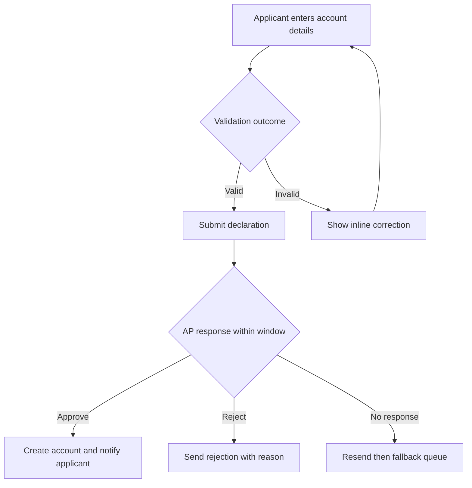

# Journey: NHS New Starter Registration with Early Validation

**Primary Actor:** Priya Chandrasekaran  
**Duration:** 1 to 2 working days  
**Preconditions:** Applicant has an NHS mail address and can access ImmForm account number and organisation code  
**Success Criteria:** Applicant account is activated within two working days with no helpdesk intervention

## Overview

This journey covers a first-time NHS applicant joining an existing GP account and needing access before the next vaccine ordering cycle. It demonstrates the standard happy path for the alpha service, including early account and organisation validation and time-bound approval routing.

The journey is important because it replaces a manual PDF and email process that currently creates avoidable delay and error loops. It also demonstrates the service objective of reducing activation time while preserving traceability and named accountability.

## Main Flow

| Step | Actor | Action | System Response | Touchpoint | Notes |
|------|-------|--------|-----------------|-----------|-------|
| 1 | Priya | Opens registration service | Shows required data checklist and journey start guidance | Web | Checklist includes account number and organisation code |
| 2 | Priya | Enters name, role, individual email, account details | Validates mandatory fields and email format | Web | Shared mailbox rule shown before submit |
| 3 | System | Validates account and organisation code pair | Returns AP identity for target account | API | Failure is handled before declaration submit |
| 4 | Priya | Reviews declaration and submits | Creates registration record and immutable event log entry | Web | Submission timestamp stored |
| 5 | System | Sends approval request to AP | Sends AP email with approve and reject links and expiry time | GOV.UK Notify | 72-hour approval window starts |
| 6 | Linda | Approves request from email action link | Records AP decision and notifies applicant | Email | No portal login needed for AP |
| 7 | System | Creates ImmForm user account | Sends activation confirmation to applicant | API and Email | End state is activated |

## Sequence Diagram: Actor Interactions

## Decision Points & Variations

### Decision Point 1: Account and organisation validation
**Condition:** When validation returns a mismatch

**Path A: Valid pair**
- Continue to declaration and submit
- Route approval to AP

**Path B: Invalid pair**
- Show inline correction guidance
- Prevent submit until corrected

### Decision Point 2: AP response window
**Condition:** When AP has not responded before expiry

**Path A: AP acts within window**
- Record decision
- Continue to activation or rejection notification

**Path B: AP does not act**
- Send scheduled reminder resend
- Move case to fallback after resend limit

## Process Flow: Decision Logic

## Touchpoints

### Digital Touchpoints
- Registration web service: Data entry, validation, declaration, status updates
- GOV.UK Notify emails: AP request, applicant status, activation notice
- ImmForm APIs: Validation and account creation

### Physical Touchpoints
- Local handover notes from outgoing staff: Source of account number

### People Involved
- Applicant: Completes registration and declaration
- Authorised Person: Approves or rejects request
- Helpdesk case handler: Involved only for fallback

## Pain Points & Opportunities

### Current Pain Points
- Applicants often do not have account identifiers to hand
- Manual checking causes delayed error discovery

### Opportunities for Improvement
- Add guided pre-check panel before form start
- Add self-serve status page for in-flight approvals

## Accessibility Considerations

- Clear heading structure and field-level error messaging aligned to WCAG 2.1 AA
- Keyboard-first form navigation and logical focus movement after validation errors

## Related Personas

- Linda Forsythe: Provides approval decision
- David Acheampong: Current state manual processor displaced from happy path

## Related Journeys

- journey-authorised-person-approval.md: AP decision workflow details
- journey-fallback-case-resolution.md: Exception path after expiry or routing failure

## Notes

This is the baseline alpha success path and should represent the majority of NHS registrations.

## Data Elements

- Applicant name and role: Identity and accountability
- Individual email address: Notification and anti-shared-mailbox enforcement
- ImmForm account number: Target account for access
- Organisation code: Pair validation key
- AP decision and timestamp: Approval evidence

## Service Level Expectations

- Standard case activation within two working days
- Validation failures resolved inline without helpdesk intervention
