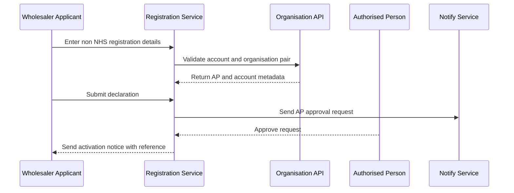
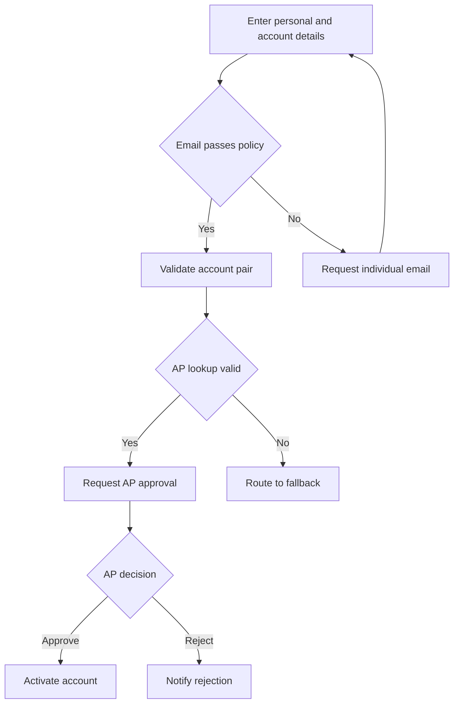

# Journey: Non NHS Wholesaler Registration with Compliance Evidence

**Primary Actor:** Marcus Obi  
**Duration:** 1 to 3 working days  
**Preconditions:** Applicant has licensed wholesaler context and valid account identifiers  
**Success Criteria:** Access is granted with an auditable record usable in GDP documentation

## Overview

This journey represents non-NHS registration where compliance context is stronger and users need confidence that records are inspection-ready. It demonstrates that the service can support licensed wholesaler workflows without forcing return to manual PDF processing.

The journey focuses on policy clarity for individual email use, accurate AP routing, and structured outcome evidence suitable for internal compliance retention.

## Main Flow

| Step | Actor | Action | System Response | Touchpoint | Notes |
|------|-------|--------|-----------------|-----------|-------|
| 1 | Marcus | Reviews registration guidance | Shows non-NHS eligibility and individual email policy | Web | Shared mailbox policy made explicit |
| 2 | Marcus | Enters applicant and account details | Performs schema checks and identity format checks | Web | Role and organisation metadata captured |
| 3 | System | Validates account and organisation code | Returns AP and account type metadata | API | Flags unsupported account types |
| 4 | Marcus | Submits declaration | Creates auditable registration event | Web | Includes declarative statements |
| 5 | System | Requests AP decision | Sends time-bound approval request | Email | Reminder schedule applied |
| 6 | AP | Approves request | Decision and identity are recorded | Email | Decision history retained |
| 7 | System | Activates account and sends outcome | Sends confirmation with reference details | API and Email | Confirmation retained in compliance folder |

## Sequence Diagram: Actor Interactions

## Decision Points & Variations

### Decision Point 1: Shared mailbox detection
**Condition:** When entered email appears to be a shared inbox

**Path A: Individual mailbox confirmed**
- Continue to declaration submit
- Proceed with AP routing

**Path B: Shared mailbox suspected**
- Show policy and require individual mailbox change
- Block submit until updated

### Decision Point 2: AP lookup quality
**Condition:** When AP returned by Organisation API is outdated

**Path A: Correct AP**
- Approval decision captured within standard window
- Continue to activation

**Path B: Incorrect AP**
- Request expires after resend limit
- Send case to fallback handler

## Process Flow: Decision Logic

## Touchpoints

### Digital Touchpoints
- Registration web service: Form completion and declaration
- Notify email templates: AP decision requests and applicant outcome
- Organisation API: AP discovery and account validation

### Physical Touchpoints
- Internal compliance pack: Evidence archive for inspections

### People Involved
- Applicant: Provides attributable identity and registration details
- Authorised Person: Provides approval decision
- Helpdesk fallback handler: Intervenes on AP routing failures

## Pain Points & Opportunities

### Current Pain Points
- Non-NHS users have low trust that pathways support regulated contexts
- AP data quality for some accounts is inconsistent

### Opportunities for Improvement
- Add account-type-aware guidance panel before submit
- Add structured confirmation export link in completion notice

## Accessibility Considerations

- Plain language guidance for policy constraints without legal jargon overload
- Error summaries linked to form fields and readable by assistive technology

## Related Personas

- Sanjay Patel: Similar compliance depth in holding centre context
- Rachel Thornton: Consumes lifecycle records as compliance evidence

## Related Journeys

- journey-holding-centre-critical-supply-registration.md: Higher-risk non-NHS supply continuity case
- journey-audit-evidence-retrieval.md: Audit retrieval and export workflow

## Notes

This journey validates non-NHS viability and reduces manual fallback due to policy ambiguity.

## Data Elements

- Organisation type marker: Distinguishes non-NHS context
- Email policy result: Captures enforcement outcome
- AP identity and decision metadata: Compliance attribution
- Activation reference: Record retrieval key

## Service Level Expectations

- Non-NHS standard cases complete within three working days
- Any AP routing issue escalated to fallback within one expiry cycle
