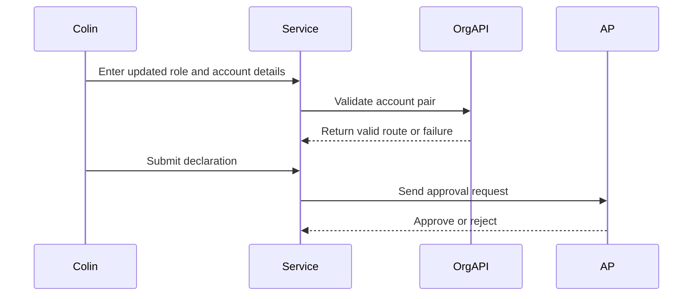
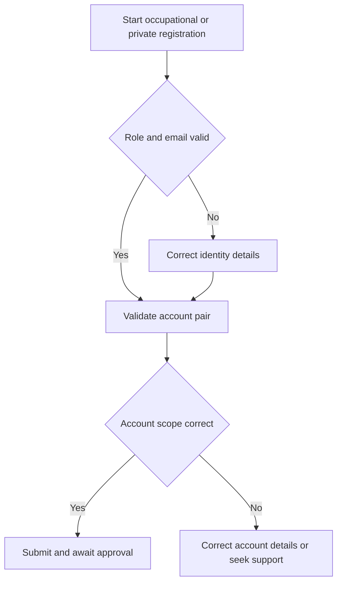

# Journey: Occupational Health and Private Registration Context

**Primary Actor:** Colin Rafferty  
**Duration:** 1 to 3 working days  
**Preconditions:** Applicant has private or occupational account identifiers for BCG and TB PPD scope  
**Success Criteria:** Registration completes with correct account scope and attributable user access

## Overview

This journey provides context coverage for occupational health and private settings where account scope can be narrower and policy-sensitive.

The core registration steps are unchanged, but the variant highlights account scope correctness and role continuity for seasonal programmes.

## Main Flow

| Step | Actor | Action | System Response | Touchpoint | Notes |
|------|-------|--------|-----------------|-----------|-------|
| 1 | Colin | Starts registration for current role credentials | Shows standard requirements list | Web | Same start pattern |
| 2 | Colin | Enters personal details and account pair | Validates account and organisation data | Web and API | Existing access history may differ |
| 3 | System | Resolves AP and eligibility path | Returns route and status | API | Must align with account record |
| 4 | Colin | Submits declaration | Creates auditable submission event | Web | Standard declaration step |
| 5 | AP | Approves request | System proceeds to account creation | Email and API | Activation follows approval |

## Sequence Diagram: Actor Interactions

## Decision Points & Variations

### Decision Point 1: Role and email transition
**Condition:** Applicant changed role or email since prior access

**Path A: New details accepted**
- Continue standard registration
- Create new attributable record

**Path B: Details conflict with pending state**
- Trigger duplicate or validation checks
- Correct and resubmit

### Decision Point 2: Account scope confidence
**Condition:** Applicant uncertain account is correct for occupational or private context

**Path A: Correct account scope**
- AP route resolves and approval proceeds
- Activation completes

**Path B: Incorrect scope account**
- Validation or AP route fails
- Helpdesk guidance used for correction

## Process Flow: Decision Logic

## Touchpoints

### Digital Touchpoints
- Registration service pages
- Organisation API validation
- AP decision email flow

### Physical Touchpoints
- Internal team handover and programme planning notes

### People Involved
- Occupational health applicant
- Authorised Person
- Helpdesk support for account scope ambiguity

## Pain Points & Opportunities

### Current Pain Points
- Role changes can create uncertainty about correct registration route
- Seasonal deadlines make delays costly

### Opportunities for Improvement
- Add role-change guidance in pre-start content
- Provide account scope examples for private and occupational contexts

## Accessibility Considerations

- Error summaries remain plain-language and field-linked
- Change links and correction loops are keyboard-friendly

## Related Personas

- Priya Chandrasekaran: Similar timeline pressure in routine programmes
- Marcus Obi: Comparable compliance sensitivity in non-NHS contexts

## Related Journeys

- journey-account-validation-failure.md: Invalid pair correction loop
- journey-duplicate-detection-error.md: Duplicate prevention path

## Notes

Requirement mapping: Section 3.3 user group coverage for occupational health and private orderers.

## Data Elements

- Applicant identity and role fields
- Account and organisation identifiers
- AP route and final outcome state

## Service Level Expectations

- Context-specific ambiguity should be resolved before submission
- Activation target should remain within standard service expectations
