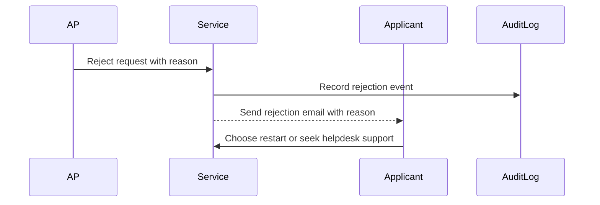
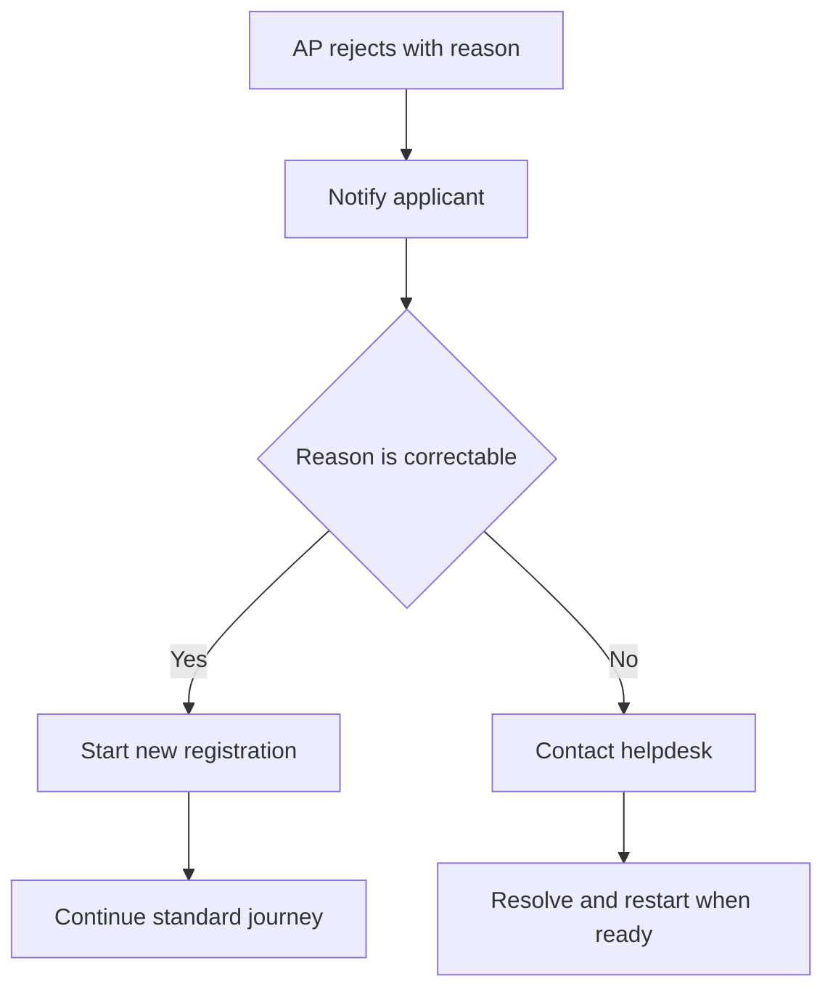

# Journey: Registration Rejection Outcome and Recovery

**Primary Actor:** Applicant  
**Duration:** 5 to 30 minutes for review and recovery decision  
**Preconditions:** Authorised Person has rejected registration with reason  
**Success Criteria:** Applicant receives reasoned outcome and clear next action path

## Overview

This journey focuses on the post-rejection experience for applicants. It ensures rejection reasons are communicated clearly and that users understand whether to restart, correct data, or contact helpdesk.

The journey separates rejection handling from approval happy path to improve clarity of outcomes and reduce repeated failed submissions.

## Main Flow

| Step | Actor | Action | System Response | Touchpoint | Notes |
|------|-------|--------|-----------------|-----------|-------|
| 1 | AP | Rejects request and enters reason | Stores mandatory rejection reason | Web | EVT-08 generated |
| 2 | System | Sends rejection notice to applicant | Includes rejection reason and next steps | Email | FR-14 communication |
| 3 | Applicant | Reviews rejection message | Chooses restart or support route | Email and Web | No silent failure |
| 4 | Applicant | Starts new registration where appropriate | Creates new session and flow | Web | Previous record retained |
| 5 | System | Preserves rejected record in audit log | Makes record available to QA role | Audit | Compliance traceability |

## Sequence Diagram: Actor Interactions

## Decision Points & Variations

### Decision Point 1: Rejection reason category
**Condition:** Reason indicates correctable data issue versus account ownership issue

**Path A: Correctable issue**
- Applicant restarts with corrected details
- New registration proceeds through normal flow

**Path B: Non-correctable issue**
- Applicant contacts helpdesk
- Manual guidance resolves ownership or policy concern

### Decision Point 2: Applicant action after notification
**Condition:** Applicant chooses immediate retry or delayed action

**Path A: Immediate retry**
- Starts new registration quickly
- Potentially meets operational deadline

**Path B: Delayed action**
- Waits for internal clarification
- May risk programme delay

## Process Flow: Decision Logic

## Touchpoints

### Digital Touchpoints
- AP rejection form with mandatory reason
- Applicant rejection email and guidance
- Audit log record for rejected case

### Physical Touchpoints
- None

### People Involved
- Authorised Person: Provides rejection decision and reason
- Applicant: Receives outcome and takes next action
- Helpdesk: Supports unresolved ownership or policy issues

## Pain Points & Opportunities

### Current Pain Points
- Rejections can feel abrupt if reason is unclear
- Users may repeat same error without targeted guidance

### Opportunities for Improvement
- Standardize reason categories with plain-language outcomes
- Provide direct restart link with checklist reminder

## Accessibility Considerations

- Rejection email uses plain language and clear action statements
- Restart path is keyboard and screen-reader compatible

## Related Personas

- Linda Forsythe: AP who may reject unknown applicants
- Priya Chandrasekaran: Applicant who needs fast recovery path

## Related Journeys

- journey-authorised-person-approval.md: AP decision capture flow
- journey-nhs-new-starter-registration.md: Restart target journey

## Notes

Requirement mapping: FR-14, EVT-08.

## Data Elements

- Rejection reason text
- AP identity and timestamp
- Applicant notification timestamp

## Service Level Expectations

- Rejection notice sent immediately after decision
- Rejected record remains queryable in audit trail
