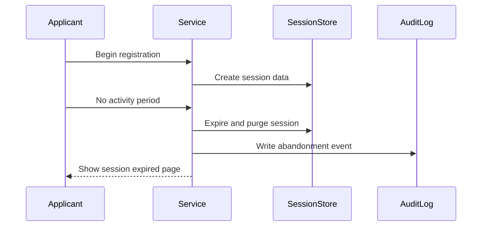
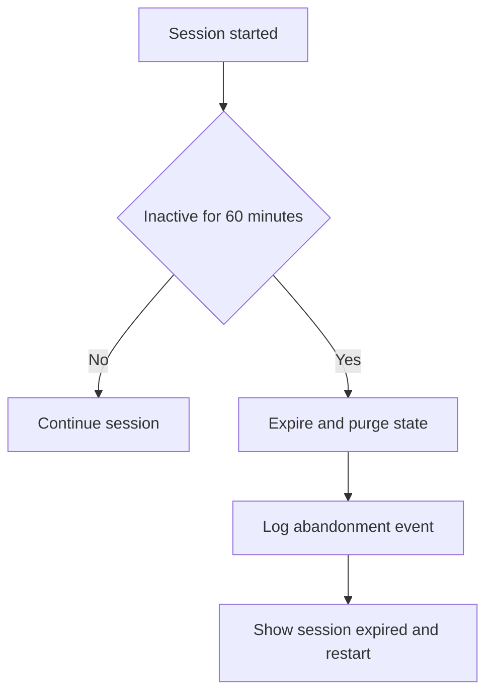

# Journey: Session Timeout and Abandonment Handling

**Primary Actor:** System  
**Duration:** 60 minutes inactivity plus restart time  
**Preconditions:** Applicant started registration session and then became inactive  
**Success Criteria:** Session expires securely, abandonment event is logged, and restart path is clear

## Overview

This journey covers inactivity timeout handling for in-progress registrations. It ensures secure session expiry and captures abandonment telemetry for service performance analysis.

The journey prevents stale sessions and unintended data exposure while keeping re-entry simple for users.

## Main Flow

| Step | Actor | Action | System Response | Touchpoint | Notes |
|------|-------|--------|-----------------|-----------|-------|
| 1 | Applicant | Starts journey and enters data | Session is created | Web | Session cookie is server-backed |
| 2 | Applicant | Leaves session inactive | Inactivity timer continues | Web | No input events observed |
| 3 | System | Reaches 60-minute inactivity threshold | Expires and purges session state | Backend | Security control |
| 4 | System | Writes abandonment event | Logs EVT-05 with timestamp | Audit log | No notify email |
| 5 | Applicant | Returns after timeout | Sees session expired message and restart action | Web | Must start new session |

## Sequence Diagram: Actor Interactions

## Decision Points & Variations

### Decision Point 1: User returns before timeout
**Condition:** Activity resumes before 60 minutes

**Path A: Activity resumes**
- Session remains valid
- User continues journey

**Path B: No activity until threshold**
- Session expires and state purged
- User must restart

### Decision Point 2: Resume expectation
**Condition:** User expects previous data to persist after timeout

**Path A: User restarts successfully**
- New session starts
- User re-enters data

**Path B: User cannot restart**
- Directed to helpdesk assisted path
- Journey exits

## Process Flow: Decision Logic

## Touchpoints

### Digital Touchpoints
- Session middleware and store
- Session expired page
- Audit logging pipeline

### Physical Touchpoints
- None

### People Involved
- Applicant: Re-enters after timeout
- Helpdesk: Optional assisted fallback

## Pain Points & Opportunities

### Current Pain Points
- Timeout can feel sudden without user awareness
- Restart effort can be high if many fields were entered

### Opportunities for Improvement
- Add inactivity warning before hard timeout
- Add save-for-later only if policy allows in future phase

## Accessibility Considerations

- Expired session page has clear heading and single primary action
- Message explains timeout in plain language

## Related Personas

- Priya Chandrasekaran: Likely interrupted by operational tasks
- Donna Eze: Clinical context increases interruption risk

## Related Journeys

- journey-nhs-new-starter-registration.md: Normal completion path
- journey-field-validation-error-correction.md: Restarted journey may encounter validation path

## Notes

Requirement mapping: EVT-05, NFR-09.

## Data Elements

- Session id and expiry timestamp
- Abandonment event record
- Correlation id where applicable

## Service Level Expectations

- Session expires at 60 minutes of inactivity
- Abandonment event is logged immediately on expiry
