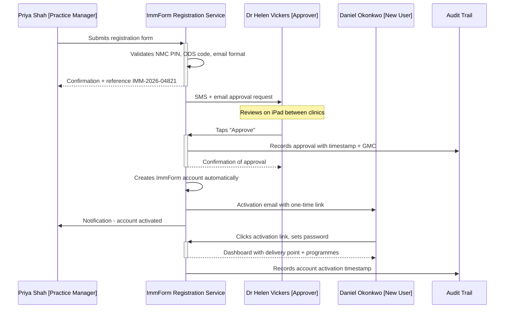
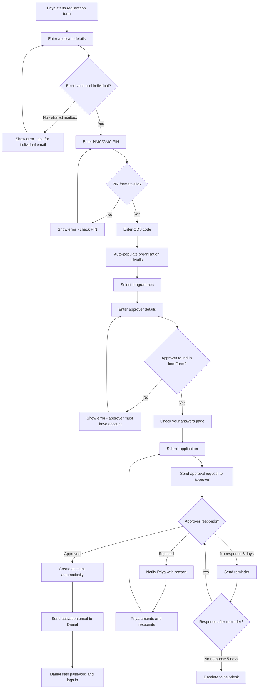
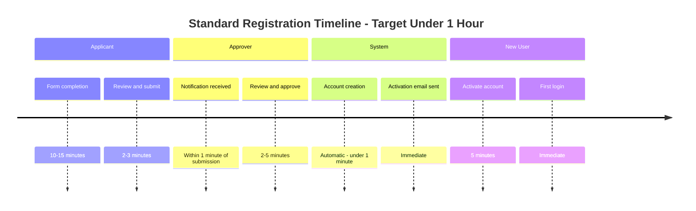

# Journey: Standard Self-Service Registration (GP Practice — Happy Path)

**Primary Actor:** Priya Shah — GP Practice Manager  
**Duration:** Under 1 hour (form start to account activation for straightforward cases)  
**Preconditions:**
- The practice (Cherrywood Medical Centre) is already registered in ImmForm with a known ODS code
- Priya has an existing ImmForm account herself
- The new joiner (Daniel Okonkwo, practice nurse) has an active NMC registration and an individual NHS.net email address
- The approving manager (Dr Helen Vickers, senior partner) has an existing ImmForm account and is reachable digitally
- The practice's delivery-point details are already configured in ImmForm

**Success Criteria:**
- Daniel's ImmForm account is created and active within 1 working day
- Zero manual re-keying by the helpdesk
- A timestamped, machine-readable audit trail exists for the entire registration
- Dr Helen Vickers' approval is recorded with timestamp and identity confirmation
- Daniel can log in and place a vaccine order the same day his account is activated

## Overview

This is the core happy-path journey for the redesigned ImmForm self-service registration. It replaces the current process where Priya downloads a PDF form (V2.6), fills it in manually, emails it to `helpdesk@immform.org.uk`, waits for the helpdesk to email Dr Vickers for informal approval, and then waits up to five working days for account creation.

The new journey demonstrates the key value proposition of the redesign: a self-service digital form with real-time validation, automated approver notification, structured approval, and immediate account activation — reducing the median time-to-account from five working days to under one hour for straightforward cases.

This journey is the most common registration path, covering routine immunisation programme staff at GP practices. It accounts for the largest volume of registrations and is the baseline against which all edge-case journeys are measured.

## Main Flow

| Step | Actor | Action | System Response | Touchpoint | Notes |
|------|-------|--------|-----------------|------------|-------|
| 1 | Priya | Navigates to ImmForm registration page and selects "Register a new user" | Displays registration form with progress indicator (Step 1 of 4: Applicant Details) | Web | Accessible from the ImmForm landing page, no login required to start |
| 2 | Priya | Enters Daniel's full name, date of birth, and individual NHS.net email address | Validates email format in real time, rejects shared mailboxes with clear error: "Enter an individual email address, not a shared mailbox" | Web | Shared-mailbox detection prevents a common error early |
| 3 | Priya | Enters Daniel's NMC PIN | System validates NMC PIN format and check digit in real time, confirms "NMC registration found" with registrant name displayed for visual confirmation | Web | Real-time validation against NMC format rules prevents typos |
| 4 | Priya | Enters the practice ODS code (e.g. Y02734) | Auto-populates organisation name, address, and existing ImmForm delivery-point details, asks Priya to confirm: "Is this the correct organisation?" | Web | ODS lookup eliminates manual re-keying of organisation details |
| 5 | Priya | Confirms the organisation details and selects the delivery point | Displays the practice's existing delivery points, Priya selects the correct one | Web | Multiple delivery points supported for multi-site practices |
| 6 | Priya | Selects the programme(s) the new user needs access to (e.g. Routine Childhood, Seasonal Flu, Shingles) | Displays available programmes for the organisation type, allows multi-select | Web | Programme selection is filtered by organisation type |
| 7 | Priya | Enters the approving manager's details: name, email, role, GMC/GPhC number | System validates the approver is a recognised ImmForm account holder, displays: "Dr Helen Vickers — Senior Partner, Cherrywood Medical Centre. Confirm?" | Web | Approver must have an existing ImmForm account (riskiest assumption in scope) |
| 8 | Priya | Reviews the complete application summary on a single "Check your answers" page | Displays all entered information in a structured summary with "Change" links next to each section | Web | GDS "Check your answers" pattern |
| 9 | Priya | Submits the application | System generates a unique application reference (e.g. IMM-2026-04821), sends confirmation email to Priya, sends approval-request notification to Dr Vickers via email and SMS | Web + Email + SMS | Application reference enables status tracking |
| 10 | Dr Vickers | Receives SMS notification: "ImmForm: New registration request for Daniel Okonkwo at Cherrywood Medical Centre. Review and approve: [link]" | — | SMS + Email | Time-bounded: "Please respond within 3 working days" |
| 11 | Dr Vickers | Taps the link on her iPad, reviews the structured approval screen showing Daniel's name, NMC PIN, role, programme access requested | Displays a clear summary with "Approve" and "Reject" buttons, plus an optional "Add note" field | Mobile Web | Mobile-optimised, single-screen, large tap targets |
| 12 | Dr Vickers | Taps "Approve" | System records approval with timestamp, Dr Vickers' identity (GMC number), and IP address. Sends confirmation to Dr Vickers and Priya | Mobile Web | Structured, timestamped approval — replaces informal email |
| 13 | System | Automatically creates Daniel's ImmForm account, assigns programme permissions, and generates temporary credentials | Sends account-activation email to Daniel's NHS.net address with a one-time login link (expires in 48 hours) | Email | No helpdesk intervention required |
| 14 | Daniel | Opens the activation email, clicks the one-time link, sets his password, and logs into ImmForm | Account is active, dashboard shows his delivery point and available programmes | Web | Daniel can now place vaccine orders |
| 15 | System | Records the complete registration audit trail: application submitted (timestamp), approval received (timestamp, approver identity), account created (timestamp) | Audit record available in the admin console for compliance export | System | MHRA GDP-compliant audit trail |

## Sequence Diagram: Actor Interactions

## Decision Points & Variations

### Decision Point 1: Email Type Validation
**Condition:** When Priya enters an email address for Daniel

**Path A: Individual NHS.net email**
- System accepts the email
- Proceeds to next field

**Path B: Shared mailbox detected**
- System displays inline error: "Enter an individual email address, not a shared mailbox"
- Priya must enter Daniel's personal NHS.net address
- Form does not proceed until corrected

### Decision Point 2: NMC PIN Validation
**Condition:** When Priya enters Daniel's NMC PIN

**Path A: Valid NMC PIN format and check digit**
- System confirms: "NMC registration found — Daniel Okonkwo"
- Proceeds to next field

**Path B: Invalid NMC PIN format or check digit**
- System displays inline error: "Enter a valid NMC PIN. Check the number and try again"
- Priya corrects the PIN

**Path C: NMC PIN valid but name mismatch**
- System displays warning: "The name on the NMC register does not match. Please check and confirm"
- Priya can confirm or correct (handles married names, name changes)

### Decision Point 3: Approver Recognition
**Condition:** When Priya enters the approver's details

**Path A: Approver has an existing ImmForm account**
- System identifies the approver, displays their details for confirmation
- Proceeds to submission

**Path B: Approver not found in ImmForm**
- System displays: "We could not find this approver in ImmForm. The approving manager must have an existing ImmForm account"
- Priya must identify a different approver or contact the helpdesk

### Decision Point 4: Approver Response
**Condition:** After the approval request is sent

**Path A: Approved within 3 working days**
- Account is created automatically (happy path)

**Path B: Rejected by approver**
- System notifies Priya with the rejection reason
- Priya can amend and resubmit or contact the approver

**Path C: No response within 3 working days**
- System sends a reminder to the approver
- After 5 working days with no response, system escalates to the helpdesk queue

## Process Flow: Decision Logic

## Timeline: End-to-End Registration

## Touchpoints

### Digital Touchpoints
- **ImmForm registration form (web):** Self-service form with real-time validation, progress indicator, "Check your answers" summary
- **Email (NHS.net):** Confirmation to applicant, approval request to approver, activation email to new user
- **SMS:** Approval-request notification to approver (mobile-friendly link)
- **ImmForm admin console:** Audit trail record visible to helpdesk and compliance

### Physical Touchpoints
- None required in the happy path — fully digital

### People Involved
- **Priya Shah (Practice Manager):** Initiates and submits the registration
- **Dr Helen Vickers (Senior Partner):** Reviews and approves the registration
- **Daniel Okonkwo (New User):** Activates his account and sets a password
- **Helpdesk (fallback only):** Involved only if the approver does not respond within 5 working days

## Pain Points & Opportunities

### Current Pain Points (As-Is)
- **5-day SLA:** Current PDF + email process takes up to 5 working days, delaying vaccine ordering
- **Manual re-keying:** Helpdesk re-keys 20+ fields from PDF into back-office system, introducing typos
- **Informal approval:** Approver contacted via unstructured email with no time-bound ask
- **No progress visibility:** Priya cannot see where her submission is in the process
- **Audit gap:** Email threads do not meet MHRA GDP records-management requirements
- **Shared-mailbox confusion:** Applicants discover the shared-mailbox rule only after submission fails

### Opportunities for Improvement (To-Be)
- **Real-time validation:** Catch errors at point of entry (NMC PIN, email format, ODS code), not days later
- **ODS auto-lookup:** Eliminate manual entry of organisation details
- **Structured mobile approval:** One-tap approve/reject on mobile with timestamp and identity
- **Automated account creation:** Remove helpdesk from the happy path entirely
- **Progress tracking:** Application reference + status dashboard + email notifications
- **Audit by design:** Every step timestamped and exportable for MHRA compliance

## Accessibility Considerations

- All form fields have visible labels and associated `<label>` elements (WCAG 1.3.1)
- Error messages are linked to the relevant field and announced by screen readers (WCAG 3.3.1)
- Progress indicator uses text labels, not colour alone (WCAG 1.4.1)
- "Check your answers" summary is navigable by keyboard (WCAG 2.1.1)
- Mobile approval screen has minimum 44x44px tap targets (WCAG 2.5.8)
- Plain English throughout — no jargon, no acronyms without expansion (NHS content style guide)
- Form can be completed in multiple sessions (save and return) for users with limited time
- SMS notification includes a text summary, not just a link, for users with limited data

## Related Personas

- **Priya Shah (Persona 1):** Submits the registration — the primary actor
- **Daniel Okonkwo (Persona 2):** The new user whose account is being created
- **Dr Helen Vickers (Persona 8):** The approver — her mobile approval experience is covered in detail in Journey 2
- **Sarah Mitchell (Persona 10):** Helpdesk agent — only involved if the approval times out (escalation path)

## Related Journeys

- **Journey 2: Mobile Approval by Small-Org Approver** — detailed view of Dr Vickers' approval experience (step 11 in this journey)
- **Journey 9: Validation Error Recovery** — what happens when Daniel's details fail validation
- **Journey 10: Helpdesk Exception Handling** — what happens when the approval times out or the organisation is unrecognised
- **Journey 12: Applicant Status Tracking** — Priya checking progress after submission

## Notes

- The riskiest assumption in this journey is that Dr Vickers (the approver) has an existing ImmForm account and is digitally reachable. If this assumption fails, the journey falls through to the helpdesk exception path (Journey 10).
- The 1-hour target applies to straightforward cases where all validation passes and the approver responds promptly. The system must degrade gracefully to the reminder/escalation path without losing the applicant's data.
- NMC PIN validation is format-based (check digit) at point of entry. Full NMC register lookup is a potential future enhancement but is not in scope for Alpha.
- The audit trail must satisfy both MHRA GDP requirements (Dr Olu Babatunde, persona 14) and UK GDPR requirements (Rachel Goldstein, persona 15).
