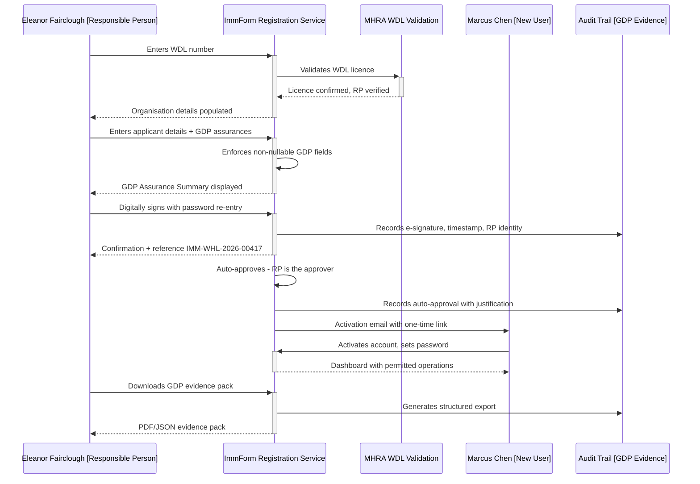
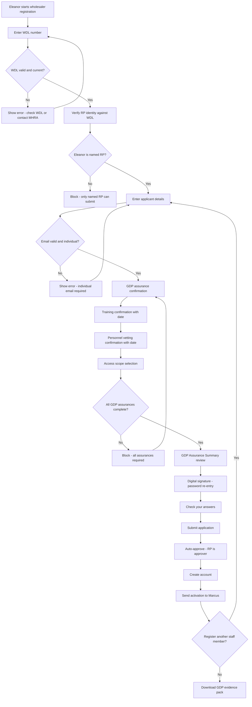

# Journey: Wholesaler Registration with GDP Compliance

**Primary Actor:** Eleanor Fairclough — Wholesaler Responsible Person (WDA(H))  
**Duration:** Under 1 hour (form start to account activation, assuming prompt approval)  
**Preconditions:**
- The wholesaler organisation holds a valid MHRA Wholesale Dealer Licence (WDA(H)) and is already registered in ImmForm
- Eleanor has an existing ImmForm account as the named Responsible Person
- The new operative (Marcus Chen, warehouse operative) has completed GDP training and holds a valid DBS check
- The organisation's WDL number and delivery-point details are already configured in ImmForm
- Eleanor understands that GDP assurances must be digitally confirmed as part of the registration

**Success Criteria:**
- Marcus's ImmForm account is created with appropriate warehouse-operative permissions
- All GDP assurances are digitally confirmed, timestamped, and attributable to Eleanor as RP
- An MHRA-defensible audit trail is generated — exportable as a structured evidence pack (JSON or PDF)
- No paper signatures, no email-thread evidence, no unstructured artefacts
- Dr Olu Babatunde (UKHSA GDP Compliance Lead) can export the assurance record for inspection purposes
- Marcus can log in and manage stock movements the same day

## Overview

This journey addresses the regulatory gap that Eleanor Fairclough identifies as her primary pain point: the current PDF-and-email registration process collects GDP assurances as paper signatures with no enforced confirmation, no version stamping, and no machine-readable record. Email threads used as the audit trail will not survive an MHRA GDP inspection under Chapter 4 of the EU/UK GDP guidelines.

The redesigned journey enforces GDP assurances digitally at the point of registration. Each assurance is a structured, non-nullable field that the Responsible Person must explicitly confirm. The system captures the confirmation with a timestamp, the RP's identity (tied to their WDA(H) licence), and a version-stamped record that can be exported for MHRA inspection.

This journey demonstrates the corporate multi-staff registration capability that Eleanor needs: the ability to register multiple warehouse operatives under a single organisational envelope, with the RP providing GDP assurances once per submission batch (or per individual, depending on the assurance type). It also shows how the system produces evidence that satisfies both MHRA GDP requirements (Dr Olu Babatunde, persona 14) and UK GDPR data-protection requirements (Rachel Goldstein, persona 15).

## Main Flow

| Step | Actor | Action | System Response | Touchpoint | Notes |
|------|-------|--------|-----------------|------------|-------|
| 1 | Eleanor | Navigates to ImmForm registration and selects "Register a wholesaler staff member" | Displays the wholesaler registration form with progress indicator (Step 1 of 5: Organisation Verification) | Web | Separate entry point for wholesaler registrations, reflecting different regulatory requirements |
| 2 | Eleanor | Enters the organisation's WDL number (e.g. WDA(H) 12345) | System validates the WDL number against MHRA records, auto-populates organisation name, licensed activities, and delivery points | Web | WDL validation confirms the wholesaler is currently licensed |
| 3 | Eleanor | Confirms her identity as the named Responsible Person | System verifies Eleanor's existing ImmForm account against the WDL record: "Eleanor Fairclough — Responsible Person, Northern Pharma Distribution Ltd. Confirmed" | Web | RP identity linked to WDL provides regulatory attribution |
| 4 | Eleanor | Enters Marcus Chen's details: full name, role (warehouse operative), email address, employee ID | System validates email format (rejects shared mailboxes), checks for duplicate registrations | Web | Step 2 of 5: Applicant Details |
| 5 | Eleanor | Confirms Marcus has completed GDP training | System presents a structured confirmation: "I confirm that Marcus Chen has completed GDP-compliant training as required under EU/UK GDP Chapter 2.8" with a checkbox and date field for training completion | Web | Enforced, non-nullable GDP assurance — cannot be skipped |
| 6 | Eleanor | Confirms Marcus has a valid DBS check | System presents: "I confirm that appropriate personnel vetting has been completed for Marcus Chen as required under EU/UK GDP Chapter 2.3" with checkbox and date | Web | Second GDP assurance — structured and timestamped |
| 7 | Eleanor | Confirms the scope of Marcus's access: stock receipt, storage, dispatch | System presents programme/function selection filtered for wholesaler roles, with GDP implications noted for each | Web | Step 3 of 5: Access & Permissions |
| 8 | Eleanor | Reviews GDP assurance summary | System displays all assurances in a single "GDP Assurance Summary" panel: each assurance, the confirmation status, timestamp preview, and Eleanor's identity as the confirming RP | Web | Step 4 of 5: GDP Assurance Review — critical for MHRA defensibility |
| 9 | Eleanor | Digitally signs the assurance pack | System presents: "By confirming below, you are providing a digital declaration as the Responsible Person named on WDA(H) 12345. This record will be timestamped and stored as part of the MHRA audit trail." Eleanor enters her ImmForm password to confirm | Web | Password re-entry as e-signature — attributable and non-repudiable |
| 10 | Eleanor | Reviews the complete application on "Check your answers" page | Displays all details including GDP assurances, timestamps, and RP attribution with "Change" links | Web | Step 5 of 5: Final Review |
| 11 | Eleanor | Submits the application | System generates reference (e.g. IMM-WHL-2026-00417), records all GDP assurances with timestamps and RP identity, creates the audit-trail record | Web + Email | Confirmation email includes the reference and a summary of recorded GDP assurances |
| 12 | System | Because Eleanor is both the RP and the approver for her organisation, the system auto-approves | System records auto-approval: "Approved by Eleanor Fairclough (Responsible Person) — same-actor approval permitted for RP-submitted registrations" | System | RP has inherent authority to approve registrations for their own licensed operation |
| 13 | System | Creates Marcus's ImmForm account with warehouse-operative permissions | Sends activation email to Marcus with a one-time login link (expires in 48 hours) | Email | Permissions scoped to stock receipt, storage, and dispatch only |
| 14 | Marcus | Opens activation email, clicks the one-time link, sets his password, and logs in | Account is active, dashboard shows his delivery point and permitted operations | Web | Marcus can now manage stock movements |
| 15 | Eleanor | Downloads the GDP evidence pack for her compliance files | System generates a structured PDF/JSON export containing all assurances, timestamps, RP identity, and the full registration audit trail | Web | MHRA-inspection-ready evidence pack |

## Sequence Diagram: Actor Interactions

## Decision Points & Variations

### Decision Point 1: WDL Validation
**Condition:** When Eleanor enters the WDL number

**Path A: Valid and current WDL**
- System auto-populates organisation details
- Proceeds to RP verification

**Path B: WDL not found or expired**
- System displays: "This Wholesale Dealer Licence number could not be verified. Check the number or contact MHRA"
- Registration cannot proceed without a valid WDL

### Decision Point 2: RP Identity Verification
**Condition:** When the system checks Eleanor's ImmForm account against the WDL record

**Path A: Eleanor is the named RP on the WDL**
- System confirms and proceeds
- RP identity will be used for GDP assurance attribution

**Path B: Eleanor is not the named RP**
- System displays: "Your ImmForm account is not linked to the Responsible Person named on this WDL. Only the named RP can submit registrations with GDP assurances"
- Eleanor must ensure her ImmForm account is correctly linked, or the actual named RP must submit

### Decision Point 3: GDP Assurance Completeness
**Condition:** When Eleanor reaches the GDP Assurance Review step

**Path A: All required assurances confirmed**
- System displays the complete assurance summary
- Proceeds to e-signature

**Path B: One or more assurances not confirmed**
- System prevents progression: "All GDP assurances must be confirmed before submission. The following are incomplete: [list]"
- Eleanor must complete all assurances — they are non-nullable by design

### Decision Point 4: Multi-Staff Registration
**Condition:** After submitting Marcus's registration

**Path A: Eleanor registers a single operative**
- Standard flow as documented above

**Path B: Eleanor registers multiple operatives in batch**
- After submission, system offers: "Register another staff member for Northern Pharma Distribution Ltd?"
- Organisation verification and some GDP assurances (org-level) carry forward
- Individual-specific assurances (training, vetting) must be confirmed per person

## Process Flow: Decision Logic

## Touchpoints

### Digital Touchpoints
- **ImmForm wholesaler registration form (web):** Separate entry point with GDP assurance enforcement, WDL validation, and RP identity verification
- **Email:** Confirmation to Eleanor, activation email to Marcus
- **GDP evidence pack (PDF/JSON):** Downloadable structured export for MHRA compliance files
- **ImmForm admin console:** Audit trail accessible to UKHSA compliance team

### Physical Touchpoints
- **GDP training certificate (reference only):** Eleanor confirms training completion digitally — the physical certificate is retained by the employer, not uploaded
- **MHRA inspection (downstream):** The evidence pack produced by this journey is presented during MHRA on-site inspections

### People Involved
- **Eleanor Fairclough (Responsible Person):** Submits the registration, provides GDP assurances, and acts as approver
- **Marcus Chen (Warehouse Operative):** The new user who activates his account
- **Dr Olu Babatunde (UKHSA GDP Compliance Lead):** Can access the audit trail for UKHSA's own compliance purposes — not directly involved in this journey but relies on its outputs
- **MHRA Inspector (downstream):** Will review the evidence pack during periodic inspections

## Pain Points & Opportunities

### Current Pain Points (As-Is)
- **Paper GDP assurances:** PDF form collects GDP assurances as paper signatures — no enforced confirmation, no version stamping, no machine-readable record
- **Email-thread audit trail:** Email threads between Eleanor and the helpdesk are the de facto audit trail — Dr Olu Babatunde says they won't survive an MHRA Chapter 4 inspection
- **No e-signature capability:** Eleanor's signature on the PDF has no timestamp, no digital attribution, and no integrity protection
- **No batch registration:** Each operative requires a separate PDF submission with full re-entry of organisation details
- **Helpdesk bottleneck:** Even though Eleanor is the RP with full authority, she must wait for the helpdesk to process the PDF
- **Scanned PDF storage:** Helpdesk stores scanned PDFs as the GDP record — no structured data, no searchability

### Opportunities for Improvement (To-Be)
- **Enforced digital GDP assurances:** Non-nullable, structured fields that cannot be skipped or left blank — every assurance is timestamped and attributed
- **E-signature with password re-entry:** Attributable, non-repudiable digital declaration tied to the RP's ImmForm identity
- **Exportable evidence pack:** PDF/JSON export designed for MHRA inspection — structured, versioned, and machine-readable
- **RP self-approval:** Eliminate the helpdesk from the wholesaler happy path — the RP has inherent authority
- **Batch registration:** Register multiple operatives under a single organisational envelope with shared assurances carrying forward
- **WDL auto-validation:** Real-time WDL lookup eliminates manual verification and catches expired licences

## Accessibility Considerations

- All GDP assurance checkboxes have descriptive labels read by screen readers: "I confirm that [name] has completed GDP-compliant training" (WCAG 1.3.1)
- The GDP Assurance Summary uses a structured list, not a data table, for screen-reader clarity (WCAG 1.3.1)
- Password re-entry for e-signature has a visible "Show password" toggle (WCAG 1.3.5)
- Error messages on blocked progression are linked to the specific incomplete assurance (WCAG 3.3.1)
- Evidence pack is available in both PDF (visual) and JSON (machine-readable) formats
- All timestamps display in human-readable UK format (e.g. "14 April 2026 at 10:32am") with ISO 8601 in the export

## Related Personas

- **Eleanor Fairclough (Persona 7):** Primary actor — Wholesaler Responsible Person submitting the registration and GDP assurances
- **Marcus Chen (implicit):** The warehouse operative whose account is being created
- **Dr Olu Babatunde (Persona 14):** UKHSA GDP Compliance Lead — relies on the audit trail this journey produces
- **Rachel Goldstein (Persona 15):** DPO — ensures the registration collects only necessary personal data under UK GDPR
- **Sarah Mitchell (Persona 10):** Helpdesk agent — removed from the wholesaler happy path but available as fallback
- **James Patterson (Persona 11):** Service Manager — monitors wholesaler registration volumes for capacity planning

## Related Journeys

- **Journey 1: Standard Self-Service Registration** — the GP practice equivalent, without GDP assurance requirements
- **Journey 10: Helpdesk Exception Handling** — fallback if WDL validation fails or RP identity cannot be verified
- **Journey 7: Batch Registration for Multi-Site Organisation** — extension of this journey for wholesalers with multiple warehouse locations
- **Journey 11: Audit Trail and Compliance Export** — how Dr Olu Babatunde uses the evidence pack in MHRA inspections

## Notes

- The WDL validation is shown as a real-time lookup in this journey. In Alpha, this may be a format-based validation (similar to NMC PIN check-digit validation) with full MHRA register integration as a Beta enhancement. The format validation still provides significant value over the current unvalidated PDF field.
- The "RP self-approval" pattern (step 12) assumes that the Responsible Person named on the WDL has inherent authority to approve registrations for their organisation. This needs validation with Dr Olu Babatunde — some wholesalers may require separation of duties between RP and approver.
- Multi-staff batch registration (Decision Point 4, Path B) is shown as a variation but may be scoped as a separate user story depending on Alpha prioritisation.
- The GDP evidence pack format (JSON vs PDF vs both) should be validated with Eleanor and Dr Olu Babatunde during Alpha user research — MHRA inspectors may have preferences about evidence format.
- Eleanor's quote in the persona report is the design principle for this journey: "If ImmForm is part of my distribution chain, then its onboarding journey is part of my MHRA inspection. I need it to produce evidence — not emails."
